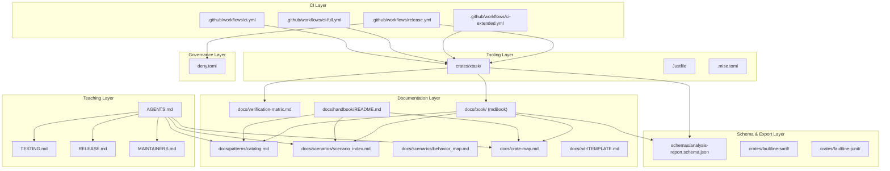
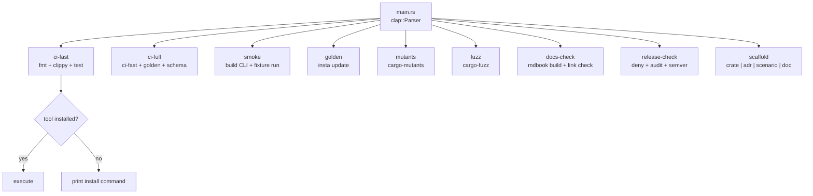
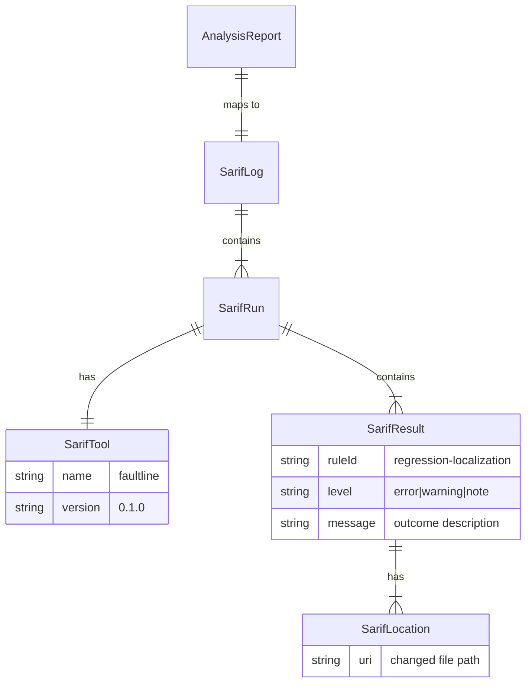

# Design Document — faultline Repo Operating System

## Overview

This design covers the meta-infrastructure layer that turns the hardened v0.1 faultline codebase into a delegation-ready, self-teaching system. The existing scaffold (12 crates, hexagonal architecture, working localization engine, persistence, CLI, renderer) and the hardening pass (frozen contract, proven core, real fixtures, safe resumability, hardened adapters, polished operator surface) are complete.

This layer adds ten reinforcing capabilities across documentation, tooling, testing, CI, and governance — none of which change the runtime behavior of faultline itself. The repo operating system targets the repo as the system under change.

### Key Design Decisions

1. **Xtask over shell scripts** — a Rust-native `cargo xtask` binary provides type-safe, cross-platform repo rituals. A `Justfile` wraps xtask for ergonomic invocation.
2. **schemars for JSON Schema generation** — derive `JsonSchema` on `faultline-types` structs to auto-generate `schemas/analysis-report.schema.json`. This keeps the schema in sync with the Rust types by construction.
3. **insta for golden tests** — snapshot testing via `insta` catches artifact drift (analysis.json, index.html, CLI help) with clear diffs and `cargo insta review` workflow.
4. **SARIF and JUnit as adapter crates** — new `faultline-sarif` and `faultline-junit` crates implement export adapters behind a simple `fn export(report: &AnalysisReport) -> Result<String>` interface, following the hexagonal pattern.
5. **mdBook for Diátaxis site** — lightweight, Rust-native, Markdown-based documentation site under `docs/book/`.
6. **CI tiers** — three workflow tiers (`ci-fast`, `ci-full`, `ci-extended`) with increasing scope and cost, each with contract-aware failure messages.
7. **mise.toml for tool pinning** — pins Rust toolchain and external tool versions in a single declarative file.
8. **Scenario atlas as living documentation** — a Markdown index cross-referenced to tests, requirements, ADRs, and fixtures, verified by CI.
9. **Pattern catalog as shared vocabulary** — named patterns with definitions, examples, anti-examples, and ADR cross-references.
10. **Scaffold subcommands** — `cargo xtask scaffold` generates boilerplate for new crates, ADRs, scenarios, and doc pages.

## Architecture

### New Artifacts and Their Relationships



### Xtask Crate Architecture



```rust
// crates/xtask/src/main.rs — top-level structure
use clap::{Parser, Subcommand};

#[derive(Parser)]
#[command(name = "xtask", about = "faultline repo operations")]
struct Cli {
    #[command(subcommand)]
    command: Command,
}

#[derive(Subcommand)]
enum Command {
    /// Run fmt + clippy + test (fast CI tier)
    CiFast,
    /// Run ci-fast + golden + schema-check (full CI tier)
    CiFull,
    /// Build CLI and run against fixture repo
    Smoke,
    /// Run and update golden/snapshot tests
    Golden,
    /// Run cargo-mutants on configured surfaces
    Mutants,
    /// Run fuzz targets (default 60s, --duration to override)
    Fuzz {
        #[arg(long, default_value_t = 60)]
        duration: u64,
    },
    /// Build docs and check links
    DocsCheck,
    /// Run cargo-deny + cargo-audit + cargo-semver-checks
    ReleaseCheck,
    /// Generate boilerplate for new repo artifacts
    Scaffold {
        #[command(subcommand)]
        kind: ScaffoldKind,
    },
}

#[derive(Subcommand)]
enum ScaffoldKind {
    /// Create a new crate under crates/
    Crate {
        name: String,
        #[arg(long)]
        tier: String, // domain | adapter | app
    },
    /// Create a new ADR under docs/adr/
    Adr { title: String },
    /// Create a new test scenario stub
    Scenario {
        name: String,
        #[arg(long, rename_all = "kebab-case")]
        crate_name: String,
    },
    /// Create a new doc page in the mdBook site
    Doc {
        title: String,
        #[arg(long)]
        section: String, // tutorial | howto | explanation | reference
    },
}
```

### New Crate Dependencies

The following new workspace dependencies are added:

| Dependency | Purpose | Crates |
|-----------|---------|--------|
| `schemars` | JSON Schema generation from Rust types | `faultline-types` |
| `insta` | Snapshot/golden testing | `faultline-render`, `faultline-cli` (dev) |
| `quick-xml` | JUnit XML generation | `faultline-junit` |

### Workspace Members (Updated)

```toml
[workspace]
members = [
  # existing 12 crates...
  "crates/faultline-sarif",    # NEW: SARIF export adapter
  "crates/faultline-junit",    # NEW: JUnit XML export adapter
  "crates/xtask",              # NEW: repo operations binary
]
```

## Components and Interfaces

### 1. Pattern Catalog (`docs/patterns/catalog.md`)

A Markdown document containing 10 named patterns. Each entry follows this structure:

```markdown
### Pattern: Truth Core / Translation Edge

**Definition:** Domain logic lives in pure crates with no I/O; all infrastructure
concerns are pushed to adapter crates behind port traits.

**When to use:** Any time you add business logic — it belongs in a domain crate.

**Example:** `faultline-localization` contains the binary narrowing algorithm with
zero filesystem or process dependencies. It operates on `RevisionSequence` and
`ProbeObservation` values injected by the app layer.

**Anti-example:** Putting `git rev-list` parsing inside `faultline-localization`
would violate this pattern — Git CLI interaction belongs in `faultline-git`.

**Related ADRs:** ADR-0001 (Hexagonal Architecture)
**Related Scenarios:** prop_binary_narrowing_selects_valid_midpoint
```

The 10 required patterns:
1. Truth Core / Translation Edge
2. Scenario Atlas
3. Artifact-First Boundary
4. Proof-Carrying Change
5. Replayable Run Memory
6. Operator Dossier
7. Human Review Gate After Failing Property
8. Mutation-On-Diff
9. Golden Artifact Contract
10. Delegation-Safe Crate Seam

### 2. ADR Template (`docs/adr/TEMPLATE.md`)

Extends the existing ADR format with a "Related Patterns" section:

```markdown
# ADR-NNNN: <title>

## Status
Proposed | Accepted | Deprecated | Superseded by ADR-XXXX

## Context
<why this decision is needed>

## Decision
<what we decided>

## Consequences
<what follows from this decision>

## Related Patterns
<references to patterns from docs/patterns/catalog.md>
```

### 3. Scenario Atlas (`docs/scenarios/`)

Two files:

**`scenario_index.md`** — flat index of every test in the workspace:

```markdown
| Scenario | Problem | Fixture/Generator | Crate(s) | Artifact | Invariant | Refs |
|----------|---------|-------------------|----------|----------|-----------|------|
| prop_exit_code_classification | Exit codes map to correct ObservationClass | arb exit_code × timed_out | faultline-probe-exec | — | P1 | Req 2.3–2.6 |
| exact_first_bad_commit_real_git | Linear history finds exact boundary | GitRepoBuilder 5-commit | faultline-git, faultline-localization | — | P5 | Req 7.4 |
| ... | ... | ... | ... | ... | ... | ... |
```

**`behavior_map.md`** — five-way cross-reference:

```markdown
| Requirement | ADR/Explanation | BDD Scenario | Fixture/Harness | Artifact/Output |
|-------------|----------------|--------------|-----------------|-----------------|
| 2.3 Exit code 0 → Pass | ADR-0003 | prop_exit_code_classification | arb exit_code | — |
| 3.2 Adjacent pass-fail → FirstBad | ADR-0003 | exact_boundary_when_adjacent | make_seq | — |
| ... | ... | ... | ... | ... |
```

### 4. JSON Schema Generation

Add `schemars` derive to all types in `faultline-types` that appear in `AnalysisReport`:

```rust
// In faultline-types/Cargo.toml:
// [dependencies]
// schemars = { workspace = true }

use schemars::JsonSchema;

#[derive(Debug, Clone, PartialEq, Eq, Serialize, Deserialize, JsonSchema)]
pub struct AnalysisReport { /* ... */ }

#[derive(Debug, Clone, PartialEq, Eq, Serialize, Deserialize, JsonSchema)]
pub struct ProbeObservation { /* ... */ }

// ... all types transitively referenced by AnalysisReport
```

Schema generation is performed by the xtask:

```rust
// In crates/xtask/src/schema.rs:
pub fn generate_schema() -> Result<()> {
    let schema = schemars::schema_for!(faultline_types::AnalysisReport);
    let json = serde_json::to_string_pretty(&schema)?;
    std::fs::write("schemas/analysis-report.schema.json", json)?;
    Ok(())
}

pub fn check_schema() -> Result<()> {
    let current = std::fs::read_to_string("schemas/analysis-report.schema.json")?;
    let expected = {
        let schema = schemars::schema_for!(faultline_types::AnalysisReport);
        serde_json::to_string_pretty(&schema)?
    };
    if current != expected {
        anyhow::bail!("schema drift detected: regenerate schemas/analysis-report.schema.json");
    }
    Ok(())
}
```

### 5. SARIF Export Adapter (`crates/faultline-sarif/`)

Converts an `AnalysisReport` into a SARIF v2.1.0 JSON document.

```rust
// crates/faultline-sarif/src/lib.rs
use faultline_types::AnalysisReport;

pub fn to_sarif(report: &AnalysisReport) -> Result<String, serde_json::Error> {
    let sarif = SarifLog {
        schema: "https://raw.githubusercontent.com/oasis-tcs/sarif-spec/main/sarif-2.1/schema/sarif-schema-2.1.0.json".into(),
        version: "2.1.0".into(),
        runs: vec![build_run(report)],
    };
    serde_json::to_string_pretty(&sarif)
}
```

Mapping:
- `AnalysisReport` → one SARIF `run`
- `LocalizationOutcome::FirstBad` → one `result` with level `"error"`, message referencing first_bad commit
- `LocalizationOutcome::SuspectWindow` → one `result` with level `"warning"`, message referencing the window
- `LocalizationOutcome::Inconclusive` → one `result` with level `"note"`
- `changed_paths` → `result.locations` with `artifactLocation.uri` set to each path
- Tool name: `"faultline"`, version from report's `schema_version`

### 6. JUnit XML Export Adapter (`crates/faultline-junit/`)

Converts an `AnalysisReport` into JUnit XML format.

```rust
// crates/faultline-junit/src/lib.rs
use faultline_types::AnalysisReport;

pub fn to_junit_xml(report: &AnalysisReport) -> String {
    // Build XML manually or via quick-xml
    // <testsuites>
    //   <testsuite name="faultline" tests="1" failures="{0|1}" ...>
    //     <testcase name="regression-localization" classname="faultline.{run_id}">
    //       <failure message="..." /> (if FirstBad or SuspectWindow)
    //       OR <system-out>Inconclusive: ...</system-out>
    //     </testcase>
    //   </testsuite>
    // </testsuites>
}
```

Mapping:
- One `<testsuite>` per report
- One `<testcase>` for the localization result
- `FirstBad` → `<failure>` with boundary details
- `SuspectWindow` → `<failure>` with window details and reasons
- `Inconclusive` → `<failure>` with reasons
- Observations listed in `<system-out>` as a summary table

### 7. Golden Tests (via insta)

Three golden test targets:

**`analysis.json` golden** — in `faultline-render`:
```rust
#[test]
fn golden_analysis_json() {
    let report = canonical_fixture_report();
    let json = serde_json::to_string_pretty(&report).unwrap();
    insta::assert_snapshot!("analysis_json", json);
}
```

**`index.html` golden** — in `faultline-render`:
```rust
#[test]
fn golden_index_html() {
    let report = canonical_fixture_report();
    let renderer = ReportRenderer::new("/tmp/unused");
    let html = renderer.render_html(&report);
    insta::assert_snapshot!("index_html", html);
}
```

**CLI `--help` golden** — in `faultline-cli`:
```rust
#[test]
fn golden_cli_help() {
    let mut cmd = Cli::command();
    let mut buf = Vec::new();
    cmd.write_long_help(&mut buf).unwrap();
    let help = String::from_utf8(buf).unwrap();
    insta::assert_snapshot!("cli_help", help);
}
```

### 8. Teaching Layer Documents

**`AGENTS.md`** (repo root) — structured for AI agent consumption:
- Purpose and mission
- Architecture overview (link to `docs/architecture.md`)
- Crate map (link to `docs/crate-map.md`)
- Scenario atlas location
- Command surface (xtask commands by tier)
- Artifact contracts (JSON schema, golden tests)
- Escalation rules
- Examples of good changes

**`TESTING.md`** (repo root):
- Verification matrix by crate tier
- How to run each CI tier locally
- How to add a new property test
- How to add a new fixture scenario
- How to update golden artifacts (`cargo insta review`)
- How to run mutation and fuzz tests

**`RELEASE.md`** (repo root):
- Version bump via workspace `Cargo.toml`
- Changelog update
- `cargo xtask release-check`
- Tag creation
- Binary distribution decision

**`MAINTAINERS.md`** (repo root):
- Code ownership by crate
- Review expectations
- Human review gate for property-test failures
- Escalation path for breaking changes

### 9. Crate Map (`docs/crate-map.md`)

```markdown
| Crate | Tier | Dependencies | Verification | Responsibility |
|-------|------|-------------|--------------|----------------|
| faultline-codes | domain | — | property tests | Shared diagnostic vocabulary |
| faultline-types | domain | faultline-codes, serde, schemars | property tests, golden | Pure value objects and report model |
| faultline-localization | domain | faultline-codes, faultline-types | property tests, mutation | Regression-window search engine |
| faultline-surface | domain | faultline-types | property tests | Coarse path-based change bucketing |
| faultline-ports | ports | faultline-types | — | Outbound hexagonal port traits |
| faultline-app | app | faultline-ports, faultline-localization, faultline-surface, faultline-types | integration, mutation | Use-case orchestration |
| faultline-git | adapter | faultline-ports, faultline-types | BDD, fuzz | Git CLI adapter |
| faultline-probe-exec | adapter | faultline-ports, faultline-types | BDD, property | Process execution adapter |
| faultline-store | adapter | faultline-ports, faultline-types | BDD, property | Filesystem run persistence |
| faultline-render | adapter | faultline-types | golden, property | JSON + HTML artifact writers |
| faultline-cli | entry | all adapters, faultline-app | smoke, golden | Operator-facing CLI |
| faultline-fixtures | testing | faultline-types | — | Fixture builders |
| faultline-sarif | adapter | faultline-types | property, golden | SARIF export adapter |
| faultline-junit | adapter | faultline-types | property, golden | JUnit XML export adapter |
| xtask | tooling | faultline-types (for schema gen) | — | Repo operations binary |
```

### 10. Verification Matrix (`docs/verification-matrix.md`)

| Crate | Property | BDD/Unit | Golden | Fuzz | Mutation | Smoke |
|-------|----------|----------|--------|------|----------|-------|
| faultline-codes | ✓ | ✓ | — | — | — | — |
| faultline-types | ✓ | ✓ | — | ✓ | — | — |
| faultline-localization | ✓ | ✓ | — | — | ✓ | — |
| faultline-surface | ✓ | ✓ | — | — | — | — |
| faultline-ports | — | — | — | — | — | — |
| faultline-app | — | ✓ | — | — | ✓ | — |
| faultline-git | — | ✓ | — | — | — | — |
| faultline-probe-exec | ✓ | ✓ | — | — | — | — |
| faultline-store | ✓ | ✓ | — | — | — | — |
| faultline-render | ✓ | ✓ | ✓ | — | — | — |
| faultline-cli | ✓ | ✓ | ✓ | — | — | ✓ |
| faultline-sarif | ✓ | ✓ | ✓ | — | — | — |
| faultline-junit | ✓ | ✓ | ✓ | — | — | — |

Minimum property-test iterations: 100 per property.
Mutation testing budget: `faultline-localization` core (narrowing + outcome), `faultline-app` orchestration loop.

### 11. mdBook Diátaxis Site (`docs/book/`)

```
docs/book/
├── book.toml
└── src/
    ├── SUMMARY.md
    ├── tutorials/
    │   └── first-run.md          # "Your First Faultline Run"
    ├── howto/
    │   └── add-property-test.md  # "Adding a New Property Test"
    ├── explanations/
    │   └── localization.md       # "How Localization Works"
    └── reference/
        ├── cli-flags.md          # CLI flag reference
        ├── artifact-schema.md    # Artifact schema reference
        ├── predicate-contract.md # Predicate contract
        └── exit-codes.md         # Exit code table
```

`book.toml`:
```toml
[book]
title = "faultline"
authors = ["faultline contributors"]
language = "en"
src = "src"

[output.html]
default-theme = "light"
```

`SUMMARY.md` links to Pattern Catalog, Scenario Atlas, Crate Map, and ADR index in the sidebar.

### 12. CI Workflow Tiers

**`.github/workflows/ci.yml`** (ci-fast — every push):
```yaml
jobs:
  ci-fast:
    runs-on: ubuntu-latest
    steps:
      - uses: actions/checkout@v4
      - uses: dtolnay/rust-toolchain@stable
        with: { components: "rustfmt, clippy" }
      - run: cargo xtask ci-fast
```

**`.github/workflows/ci-full.yml`** (PRs):
```yaml
jobs:
  ci-full:
    runs-on: ubuntu-latest
    steps:
      - uses: actions/checkout@v4
      - uses: dtolnay/rust-toolchain@stable
        with: { components: "rustfmt, clippy" }
      - run: cargo install cargo-insta
      - run: cargo xtask ci-full
```

**`.github/workflows/ci-extended.yml`** (manual/release):
```yaml
on:
  workflow_dispatch:
  push:
    tags: ["v*"]
jobs:
  extended:
    runs-on: ubuntu-latest
    steps:
      - uses: actions/checkout@v4
      - uses: dtolnay/rust-toolchain@stable
      - run: cargo install cargo-mutants cargo-deny cargo-audit cargo-semver-checks
      - run: cargo xtask mutants
      - run: cargo xtask release-check
```

**`.github/workflows/release.yml`** (tag push):
```yaml
on:
  push:
    tags: ["v*"]
jobs:
  release-check:
    runs-on: ubuntu-latest
    steps:
      - uses: actions/checkout@v4
      - uses: dtolnay/rust-toolchain@stable
      - run: cargo install cargo-deny cargo-audit cargo-semver-checks
      - run: cargo xtask release-check
```

### 13. Justfile and mise.toml

**`Justfile`**:
```just
default:
    @just --list

ci: ci-fast
ci-fast:
    cargo xtask ci-fast
ci-full:
    cargo xtask ci-full
smoke:
    cargo xtask smoke
golden:
    cargo xtask golden
mutants:
    cargo xtask mutants
fuzz duration="60":
    cargo xtask fuzz --duration {{duration}}
docs:
    cargo xtask docs-check
release-check:
    cargo xtask release-check
scaffold *args:
    cargo xtask scaffold {{args}}
```

**`.mise.toml`**:
```toml
[tools]
rust = "stable"
just = "latest"

[env]
CARGO_TERM_COLOR = "always"
```

### 14. Supply-Chain Governance (`deny.toml`)

```toml
[advisories]
vulnerability = "deny"
unmaintained = "warn"
yanked = "deny"

[licenses]
unlicensed = "deny"
allow = ["MIT", "Apache-2.0", "BSD-2-Clause", "BSD-3-Clause", "ISC", "Unicode-DFS-2016"]

[bans]
multiple-versions = "warn"
wildcards = "deny"

[sources]
unknown-registry = "deny"
unknown-git = "deny"
```

### 15. Scaffold Subcommand Architecture

Each scaffold subcommand follows the same pattern:

1. Validate inputs (crate name format, non-empty title, valid section)
2. Determine output path
3. Generate content from template
4. Write file(s)
5. Update index files (workspace Cargo.toml for crates, SUMMARY.md for docs, scenario_index.md for scenarios)

Validation rules:
- Crate names: must match `faultline-[a-z][a-z0-9-]*`
- ADR titles: non-empty string
- Scenario names: non-empty string
- Doc sections: one of `tutorial`, `howto`, `explanation`, `reference`

## Data Models

### New File/Directory Structure

```
faultline/
├── AGENTS.md                          # NEW: agent-facing onboarding
├── TESTING.md                         # NEW: verification guide
├── RELEASE.md                         # NEW: release process
├── MAINTAINERS.md                     # NEW: code ownership
├── Justfile                           # NEW: ergonomic aliases
├── .mise.toml                         # NEW: tool pinning
├── deny.toml                          # NEW: supply-chain policy
├── schemas/
│   └── analysis-report.schema.json    # NEW: generated JSON Schema
├── crates/
│   ├── ... (existing 12 crates)
│   ├── faultline-sarif/               # NEW: SARIF export
│   │   ├── Cargo.toml
│   │   └── src/lib.rs
│   ├── faultline-junit/               # NEW: JUnit XML export
│   │   ├── Cargo.toml
│   │   └── src/lib.rs
│   └── xtask/                         # NEW: repo operations
│       ├── Cargo.toml
│       └── src/main.rs
├── docs/
│   ├── ... (existing docs)
│   ├── patterns/
│   │   └── catalog.md                 # NEW: pattern catalog
│   ├── scenarios/
│   │   ├── scenario_index.md          # NEW: test index
│   │   └── behavior_map.md            # NEW: cross-reference
│   ├── handbook/
│   │   └── README.md                  # NEW: architecture handbook
│   ├── crate-map.md                   # NEW: crate index
│   ├── verification-matrix.md         # NEW: per-crate techniques
│   ├── adr/
│   │   ├── ... (existing ADRs)
│   │   └── TEMPLATE.md                # NEW: ADR template
│   └── book/                          # NEW: mdBook site
│       ├── book.toml
│       └── src/
│           ├── SUMMARY.md
│           ├── tutorials/
│           │   └── first-run.md
│           ├── howto/
│           │   └── add-property-test.md
│           ├── explanations/
│           │   └── localization.md
│           └── reference/
│               ├── cli-flags.md
│               ├── artifact-schema.md
│               ├── predicate-contract.md
│               └── exit-codes.md
└── .github/workflows/
    ├── ci.yml                         # UPDATED: uses xtask ci-fast
    ├── ci-full.yml                    # NEW: PR checks
    ├── ci-extended.yml                # NEW: mutation/fuzz/release
    └── release.yml                    # NEW: tag-triggered release check
```

### SARIF Data Model Mapping



### JUnit XML Structure

```xml
<?xml version="1.0" encoding="UTF-8"?>
<testsuites>
  <testsuite name="faultline" tests="1" failures="1" time="...">
    <testcase name="regression-localization" classname="faultline.{run_id}">
      <failure message="FirstBad: {last_good} → {first_bad}" />
      <system-out>
        Observations: 7
        History: ancestry-path
        ...
      </system-out>
    </testcase>
  </testsuite>
</testsuites>
```

### Xtask Tool Detection Model

Each xtask subcommand that depends on an external tool checks for its presence before execution:

| Subcommand | Required Tools | Install Command |
|-----------|---------------|-----------------|
| ci-fast | cargo-nextest (optional) | `cargo install cargo-nextest` |
| ci-full | cargo-insta | `cargo install cargo-insta` |
| golden | cargo-insta | `cargo install cargo-insta` |
| mutants | cargo-mutants | `cargo install cargo-mutants` |
| fuzz | cargo-fuzz | `cargo install cargo-fuzz` |
| docs-check | mdbook | `cargo install mdbook` |
| release-check | cargo-deny, cargo-audit, cargo-semver-checks | `cargo install cargo-deny cargo-audit cargo-semver-checks` |

When a tool is missing, the xtask prints:
```
error: cargo-mutants is not installed
  install: cargo install cargo-mutants
```

## Correctness Properties

*A property is a characteristic or behavior that should hold true across all valid executions of a system — essentially, a formal statement about what the system should do. Properties serve as the bridge between human-readable specifications and machine-verifiable correctness guarantees.*

The following properties were derived from the 10 requirements by analyzing each acceptance criterion for testability, performing prework analysis, consolidating redundant properties, and converting testable criteria into universally quantified statements. These properties are additive to the 36 properties from the v01-release-train and v01-hardening designs.

### Property 37: Pattern Entry Structural Completeness

*For any* pattern entry in `docs/patterns/catalog.md`, the entry shall contain all five required sections: a one-sentence definition, a "when to use" section, a concrete example, at least one anti-example, and cross-references to related ADRs and scenarios.

**Validates: Requirements 1.2**

### Property 38: Scenario Entry Structural Completeness

*For any* scenario entry in `docs/scenarios/scenario_index.md`, the entry shall contain all seven required fields: scenario name, problem description, fixture/generator, crate(s), artifact(s), invariant/property, and related references.

**Validates: Requirements 2.2**

### Property 39: Scenario Atlas Consistency

*For any* set of test functions in the workspace and scenario index entries, the scenario atlas verification logic shall: (a) report every test function that exists in the workspace but is not listed in the scenario index, and (b) report every scenario index entry that references a test function that does not exist. The reported sets shall be exactly the symmetric difference between the two.

**Validates: Requirements 2.5, 8.4**

### Property 40: JSON Schema Validates All Valid Reports

*For any* valid `AnalysisReport` (as produced by the existing proptest generators), serializing to JSON and validating against the generated `schemas/analysis-report.schema.json` shall succeed. The schema shall accept all structurally valid reports and the schema document shall contain a `$schema` draft identifier and a `title` field.

**Validates: Requirements 3.1, 3.2**

### Property 41: SARIF Export Structural Validity

*For any* valid `AnalysisReport`, the `to_sarif` function shall produce a JSON string that: (a) is valid JSON, (b) contains a `"version"` field equal to `"2.1.0"`, (c) contains a `"$schema"` field, (d) contains at least one `run` with a `tool` whose `name` is `"faultline"`, and (e) contains at least one `result` whose `level` matches the outcome type (`"error"` for FirstBad, `"warning"` for SuspectWindow, `"note"` for Inconclusive).

**Validates: Requirements 3.6**

### Property 42: JUnit XML Export Structural Validity

*For any* valid `AnalysisReport`, the `to_junit_xml` function shall produce a string that: (a) is well-formed XML, (b) contains a `<testsuites>` root element, (c) contains a `<testsuite>` element with `name="faultline"`, (d) contains a `<testcase>` element, and (e) for non-Inconclusive outcomes, contains a `<failure>` element with a non-empty `message` attribute.

**Validates: Requirements 3.7**

### Property 43: Xtask Help Completeness

*For any* invocation of the xtask binary with `--help`, the output shall contain all required subcommand names: `ci-fast`, `ci-full`, `smoke`, `golden`, `mutants`, `fuzz`, `docs-check`, `release-check`, and `scaffold`. Additionally, the `scaffold` subcommand's help shall list all scaffold kinds: `crate`, `adr`, `scenario`, `doc`.

**Validates: Requirements 5.2, 5.5, 10.1**

### Property 44: Tool Detection Error Messages

*For any* tool name that is not installed on the system, the xtask tool-detection function shall produce an error message that contains both the tool name and an install command (e.g., `cargo install <tool>`).

**Validates: Requirements 5.7**

### Property 45: Schema Drift Detection

*For any* state where the `schemas/analysis-report.schema.json` file content does not match the schema generated from the current `AnalysisReport` Rust type, the schema-check function shall return an error containing the string `"schema drift detected"`.

**Validates: Requirements 8.3**

### Property 46: CI Failure Messages Identify Broken Contract

*For any* contract check failure (schema drift, missing scenario, stale golden), the error message produced by the xtask shall contain: (a) the name of the broken contract, and (b) a reference to the relevant documentation for remediation.

**Validates: Requirements 8.7**

### Property 47: Scaffold Crate Generation

*For any* valid crate name (matching `faultline-[a-z][a-z0-9-]*`) and tier (`domain`, `adapter`, `app`), the scaffold crate function shall generate: (a) a `Cargo.toml` that inherits workspace package metadata, (b) a `src/lib.rs` file with a module doc comment, and (c) the crate name shall appear in the workspace `Cargo.toml` members list after scaffolding.

**Validates: Requirements 10.2**

### Property 48: Scaffold ADR Sequential Numbering

*For any* existing set of ADR files in `docs/adr/` with numeric prefixes, the scaffold ADR function shall generate a new ADR file whose numeric prefix is exactly one greater than the highest existing prefix, and the file shall use the ADR template from `docs/adr/TEMPLATE.md`.

**Validates: Requirements 10.3**

### Property 49: Scaffold File Generation for Scenarios and Docs

*For any* valid scenario name and target crate, the scaffold scenario function shall generate a test file stub in the target crate's `tests/` directory and add a placeholder entry to the scenario index. *For any* valid doc title and Diátaxis section, the scaffold doc function shall generate a Markdown file in the correct `docs/book/src/{section}/` directory and add an entry to `SUMMARY.md`.

**Validates: Requirements 10.4, 10.5**

### Property 50: Scaffold Input Validation

*For any* crate name that does not match the pattern `faultline-[a-z][a-z0-9-]*`, the scaffold crate function shall reject it with an error. *For any* empty string passed as an ADR title or scenario name, the scaffold function shall reject it. *For any* doc section string that is not one of `tutorial`, `howto`, `explanation`, `reference`, the scaffold doc function shall reject it.

**Validates: Requirements 10.6**

## Error Handling

### Xtask Error Scenarios

| Subcommand | Error Condition | Behavior |
|-----------|----------------|----------|
| Any | Required tool not installed | Print `"error: {tool} is not installed\n  install: cargo install {tool}"`, exit 1 |
| ci-fast | `cargo fmt --check` fails | Print `"contract broken: code formatting"`, exit 1 |
| ci-fast | `cargo clippy` fails | Print `"contract broken: lint warnings"`, exit 1 |
| ci-fast | `cargo test` fails | Print `"contract broken: test suite"`, exit 1 |
| ci-full | Golden test fails | Print `"contract broken: golden artifact {name}\n  run: cargo insta review"`, exit 1 |
| ci-full | Schema drift detected | Print `"contract broken: schema drift\n  run: cargo xtask golden\n  see: TESTING.md#updating-schemas"`, exit 1 |
| ci-full | Scenario index mismatch | Print `"contract broken: scenario atlas\n  missing entries for: {files}\n  see: TESTING.md#scenario-atlas"`, exit 1 |
| release-check | `cargo deny` finds issue | Print `"contract broken: supply-chain policy\n  see: deny.toml"`, exit 1 |
| release-check | `cargo semver-checks` finds break | Print `"contract broken: semver compatibility\n  see: RELEASE.md"`, exit 1 |
| scaffold crate | Invalid crate name | Print `"error: crate name must match faultline-[a-z][a-z0-9-]*"`, exit 1 |
| scaffold adr | Empty title | Print `"error: ADR title must be non-empty"`, exit 1 |
| scaffold doc | Invalid section | Print `"error: section must be one of: tutorial, howto, explanation, reference"`, exit 1 |

### Export Adapter Error Handling

| Adapter | Error Condition | Behavior |
|---------|----------------|----------|
| faultline-sarif | Serialization failure | Return `serde_json::Error` |
| faultline-junit | XML generation failure | Return error string |

Both adapters are pure functions that take an `&AnalysisReport` and return a `Result<String>`. They do not perform I/O — the caller decides where to write the output.

## Testing Strategy

### Dual Testing Approach

The repo operating system test suite follows the established dual strategy:

1. **Unit tests** — specific examples verifying file existence, document structure, and scaffold output
2. **Property-based tests** — universal properties across randomly generated inputs for export adapters, validation logic, and schema verification

### Property-Based Testing Library

**Library:** `proptest` (unchanged from prior specs)

**Configuration:**
- Minimum 100 iterations per property test
- Each property test tagged with: `// Feature: repo-operating-system, Property {N}: {title}`
- Each correctness property maps to exactly one `proptest` test function

### Property Test Plan

| Property | Crate Under Test | Generator Strategy |
|----------|-----------------|-------------------|
| P37: Pattern Entry Completeness | integration test | Parse catalog.md, verify each pattern has all sections |
| P38: Scenario Entry Completeness | integration test | Parse scenario_index.md, verify each entry has all columns |
| P39: Scenario Atlas Consistency | xtask | Generate random sets of test names and index entries, verify symmetric difference detection |
| P40: JSON Schema Validates Reports | faultline-types | Reuse existing `arb_analysis_report()` generator, serialize, validate against schema |
| P41: SARIF Export Validity | faultline-sarif | Reuse `arb_analysis_report()`, call `to_sarif`, verify JSON structure |
| P42: JUnit XML Export Validity | faultline-junit | Reuse `arb_analysis_report()`, call `to_junit_xml`, verify XML structure |
| P43: Xtask Help Completeness | xtask | Invoke help, verify all subcommand names present |
| P44: Tool Detection Messages | xtask | Generate random tool names, verify error message format |
| P45: Schema Drift Detection | xtask | Generate schema, modify file, verify detection |
| P46: CI Failure Messages | xtask | Trigger each failure type, verify message contains contract name and doc link |
| P47: Scaffold Crate Generation | xtask | Generate valid crate names and tiers, verify output structure |
| P48: Scaffold ADR Numbering | xtask | Generate random existing ADR counts, verify next number |
| P49: Scaffold File Generation | xtask | Generate valid names and sections, verify file creation and index updates |
| P50: Scaffold Input Validation | xtask | Generate invalid inputs (bad crate names, empty strings, bad sections), verify rejection |

### Unit Test Plan — Example Tests

| Test | Crate/Location | Description |
|------|---------------|-------------|
| Pattern catalog contains 10 patterns | integration | Verify catalog.md contains all 10 named patterns |
| ADR template has Related Patterns section | integration | Verify TEMPLATE.md contains "Related Patterns" heading |
| Handbook links to all indexes | integration | Verify handbook/README.md links to catalog, atlas, crate-map |
| Teaching layer files exist | integration | Verify AGENTS.md, TESTING.md, RELEASE.md, MAINTAINERS.md exist |
| AGENTS.md cross-references | integration | Verify AGENTS.md links to TESTING.md, RELEASE.md, etc. |
| Justfile contains all aliases | integration | Verify Justfile contains entries for all xtask subcommands |
| mise.toml pins Rust | integration | Verify .mise.toml contains rust tool entry |
| deny.toml has required sections | integration | Verify deny.toml has advisories, licenses, bans, sources |
| mdBook has four Diátaxis sections | integration | Verify SUMMARY.md references tutorials, howto, explanations, reference |
| CI workflows exist | integration | Verify ci.yml, ci-full.yml, ci-extended.yml, release.yml exist |
| Golden snapshot files exist | faultline-render, faultline-cli | Verify insta snapshot files are committed |
| Schema file exists and is valid JSON | integration | Verify schemas/analysis-report.schema.json parses as JSON |

### Golden Test Workflow

When a golden test fails:
1. Developer runs `cargo insta review` to see the diff
2. If the change is intentional, accept with `cargo insta accept`
3. Commit the updated snapshot file
4. CI re-runs and passes

The xtask `golden` subcommand wraps `cargo insta test --review` for convenience.

### Mutation Testing Configuration

Target: `faultline-localization` crate, specifically:
- `LocalizationSession::next_probe` — binary narrowing logic
- `LocalizationSession::outcome` — outcome classification logic

Configuration via `mutants.toml` or xtask flags:
```
cargo mutants -p faultline-localization -- --lib
```

### Fuzz Testing Configuration

Target: `faultline-types` crate, specifically:
- `AnalysisReport` JSON deserialization: `serde_json::from_str::<AnalysisReport>(input)`

Fuzz harness in `fuzz/fuzz_targets/`:
```rust
#![no_main]
use libfuzzer_sys::fuzz_target;
use faultline_types::AnalysisReport;

fuzz_target!(|data: &[u8]| {
    if let Ok(s) = std::str::from_utf8(data) {
        let _ = serde_json::from_str::<AnalysisReport>(s);
    }
});
```
