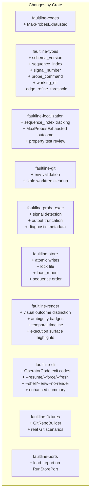

# Design Document — faultline v0.1 Hardening

## Overview

This design covers the hardening pass that takes the existing v0.1 scaffold to a releasable state. The scaffold (12 crates, hexagonal architecture, working localization engine, persistence, CLI, and renderer) is complete. This pass freezes the public contract, proves the build, corrects localization semantics, hardens adapters, makes persistence safe, replaces toy fixtures with real Git repos, polishes the operator surface, and prepares for release.

This document specifies only what changes relative to the existing codebase. It does not re-describe unchanged components.

### Key Design Decisions

1. **Remove `edge_refine_threshold`** — the field exists in `SearchPolicy` but is unused. Rather than implement edge refinement for v0.1, remove the dead field to keep the contract honest.
2. **Add `MaxProbesExhausted` ambiguity reason** — when the probe budget runs out before convergence, the engine currently stops silently. A new `AmbiguityReason` variant makes this explicit.
3. **Add `schema_version` to `AnalysisReport`** — freeze at `"0.1.0"` so future readers can detect format incompatibilities.
4. **Sequence-indexed observations owned by app/store** — add a `sequence_index: u64` field to `ProbeObservation`. The app layer assigns sequence indices as probes are executed; the store persists them in order. The localization engine consumes and respects observation order but does not own index assignment. This ensures sequence order survives resume, rerender, and export paths.
5. **Atomic persistence** — all `FileRunStore` writes use temp-file-plus-rename to prevent corruption from interrupted writes.
6. **Lock file for single-writer** — a `.lock` file in the run directory prevents concurrent invocations from corrupting shared state. This is a local-machine-only, best-effort guard — not a distributed lock. PID liveness checks are platform-specific; stale PID reuse is rare but possible.
7. **Real Git fixture harness** — `faultline-fixtures` gains a `GitRepoBuilder` that creates real temporary Git repos with real commits for adapter-level testing.
8. **OperatorCode-based exit codes** — the CLI maps outcome types to distinct exit codes instead of using 0/2 for everything.
9. **Signal-aware probe metadata** — on Unix, capture signal number as observation metadata (`signal_number` field on `ProbeObservation`). Signal termination is NOT promoted to an `AmbiguityReason` variant — the ambiguity it creates is already represented by the `Indeterminate` classification. Signal info is rendered as a diagnostic badge in HTML/logs.
10. **Output truncation with store-owned log persistence** — probe stdout/stderr is truncated at 64 KiB in the observation by the probe adapter. Full output is saved to log files by the store/app layer, not the probe adapter — keeping filesystem policy with the persistence layer.

## Architecture

The hexagonal architecture is unchanged. No new crates are added. The changes are internal to existing crates.



### Data Flow Changes

The localization loop is unchanged at the architectural level. The changes are:

1. `FaultlineApp::localize` now assigns `sequence_index` to each observation as probes are executed, and checks for `MaxProbesExhausted` when the loop ends due to budget.
2. `FileRunStore` writes use atomic rename.
3. `FileRunStore` acquires/releases a lock file around the run lifecycle.
4. `FileRunStore` persists full probe logs when output is truncated (log persistence is a store concern).
5. `ExecProbeAdapter` captures signal numbers as observation metadata and truncates output in-memory.
6. CLI maps `LocalizationOutcome` → `OperatorCode` → process exit code.

## Components and Interfaces

### 1. faultline-codes — Changes

Add one new `AmbiguityReason` variant:

```rust
pub enum AmbiguityReason {
    // ... existing variants ...
    MaxProbesExhausted,   // NEW: probe budget exhausted before convergence
    // NOTE: SignalTermination is NOT an AmbiguityReason — signal info is
    // observation metadata (signal_number field on ProbeObservation).
    // The ambiguity from signal kills is already represented by Indeterminate.
}
```

Add `Display` implementation for the new variant.

`OperatorCode` is unchanged (already exists with the right variants).

### 2. faultline-types — Changes

**`SearchPolicy`**: Remove `edge_refine_threshold`.

```rust
#[derive(Debug, Clone, PartialEq, Eq, Serialize, Deserialize)]
pub struct SearchPolicy {
    pub max_probes: usize,
    // edge_refine_threshold: REMOVED
}

impl Default for SearchPolicy {
    fn default() -> Self {
        Self { max_probes: 64 }
    }
}
```

**`AnalysisReport`**: Add `schema_version`.

```rust
pub struct AnalysisReport {
    pub schema_version: String,  // NEW: "0.1.0"
    // ... all existing fields unchanged ...
}
```

**`ProbeObservation`**: Add diagnostic fields.

```rust
pub struct ProbeObservation {
    // ... existing fields ...
    pub sequence_index: u64,         // NEW: temporal order of probing
    pub signal_number: Option<i32>,  // NEW: signal that killed the process (Unix)
    pub probe_command: String,       // NEW: effective command string for reproducibility
    pub working_dir: String,         // NEW: checkout path for reproducibility
}
```

**`RunHandle`**: Add version metadata.

```rust
pub struct RunHandle {
    pub id: String,
    pub root: PathBuf,
    pub resumed: bool,
    pub schema_version: String,  // NEW: "0.1.0"
    pub tool_version: String,    // NEW: from Cargo.toml
}
```

### 3. faultline-ports — Changes

Add `load_report` to `RunStorePort`:

```rust
pub trait RunStorePort {
    // ... existing methods ...
    fn load_report(&self, run: &RunHandle) -> Result<Option<AnalysisReport>>;  // NEW
}
```

### 4. faultline-localization — Changes

**Sequence index consumption**: The localization engine does NOT own sequence index assignment. The app/store layer assigns `sequence_index` values as probes are executed and persisted. The engine's `observation_list()` method returns observations ordered by `sequence_index` (ascending). When replaying cached observations on resume, the prior sequence indices are preserved — the engine does not reassign them.

```rust
impl LocalizationSession {
    // observation_list() returns observations sorted by sequence_index
    // record() accepts observations with pre-assigned sequence_index
    // The engine respects but does not assign sequence order
}
```

**Max-probe exhaustion**: When `next_probe()` returns `None` because `observations.len() >= max_probes` and the window has not converged, `outcome()` returns `SuspectWindow` or `Inconclusive` with `AmbiguityReason::MaxProbesExhausted`.

**`edge_refine_threshold` removal**: All references to `policy.edge_refine_threshold` are removed. The `SearchPolicy` struct no longer has this field.

**Property test review**: The `prop_monotonic_window_narrowing` test is reviewed. The fix is confirmed or the property is strengthened. The review outcome is documented in a code comment.

### 5. faultline-git — Changes

**Environment validation on construction**:

```rust
impl GitAdapter {
    pub fn new(repo_root: impl Into<PathBuf>) -> Result<Self> {
        let repo_root = repo_root.into();
        // NEW: verify git is on PATH
        Self::verify_git_available()?;
        // NEW: verify repo_root is a git repo
        Self::verify_git_repo(&repo_root)?;
        // NEW: clean stale worktrees
        let scratch_root = repo_root.join(".faultline").join("scratch");
        Self::cleanup_stale_worktrees(&scratch_root)?;
        fs::create_dir_all(&scratch_root)?;
        Ok(Self { repo_root, scratch_root })
    }
}
```

**Stale worktree cleanup**: On construction, scan `.faultline/scratch/` for existing directories and remove them via `git worktree remove --force` with fallback to `fs::remove_dir_all`. Log warnings on failure but do not error.

**Cleanup resilience**: `cleanup_checkout` already has a two-tier fallback. Add a warning log when both tiers fail, and ensure `Ok(())` is returned so the original probe result is not masked (Requirement 4.6).

### 6. faultline-probe-exec — Changes

**Signal detection** (Unix):

```rust
// After wait_with_output:
#[cfg(unix)]
let signal_number = {
    use std::os::unix::process::ExitStatusExt;
    output.status.signal()
};
#[cfg(not(unix))]
let signal_number = None;

// Classification update:
// If exit_code is None AND not timed_out AND signal_number is Some → Indeterminate
// NOTE: signal_number is observation metadata only — NOT promoted to AmbiguityReason.
// The Indeterminate classification already represents the ambiguity.
```

**Output truncation**:

```rust
const DEFAULT_TRUNCATION_LIMIT: usize = 64 * 1024; // 64 KiB

// After capturing stdout/stderr:
// If len > limit, truncate to limit bytes and append "[truncated]"
// The probe adapter only truncates the in-memory observation.
// Full log persistence is handled by the store/app layer (see faultline-store changes).
```

The truncation limit is configurable via `ProbeSpec` (add `output_truncation_bytes: Option<usize>` field).

**Diagnostic metadata**: The `probe_command` and `working_dir` fields are populated from the effective command and checkout path.

### 7. faultline-store — Changes

**Atomic writes**: All `fs::write` calls are replaced with write-to-temp-then-rename:

```rust
fn atomic_write(target: &Path, content: &[u8]) -> Result<()> {
    let tmp = target.with_extension("tmp");
    fs::write(&tmp, content)?;
    fs::rename(&tmp, target)?;
    Ok(())
}
```

**Lock file**: `prepare_run` creates a `.lock` file in the run directory. If the lock file exists and is held by another process, return an error. The lock is released on `save_report` or on drop.

```rust
// Lock file path: {run_root}/.lock
// Contains: PID + timestamp
// Check: if .lock exists, read PID, check if process is alive
//   - alive → error "another process is using this run"
//   - dead → stale lock, remove and proceed
```

**`load_report`**: New method reads `report.json` from the run directory.

```rust
fn load_report(&self, run: &RunHandle) -> Result<Option<AnalysisReport>> {
    let path = self.report_path(run);
    if !path.exists() {
        return Ok(None);
    }
    let raw = fs::read_to_string(&path)?;
    Ok(Some(serde_json::from_str(&raw)?))
}
```

**Sequence order**: `save_observation` preserves insertion order (sequence_index) instead of sorting by commit hash.

**Full log persistence**: When the app layer detects that a `ProbeObservation` has truncated stdout/stderr (ends with `"[truncated]"`), it passes the full output to the store, which writes it to `{run_dir}/logs/{commit_sha}_stdout.log` and `_stderr.log`. This keeps filesystem policy with the persistence layer, not the probe adapter.

**Version metadata**: `prepare_run` writes `schema_version` and `tool_version` into the run directory metadata.

### 8. faultline-render — Changes

**Visual outcome distinction**: `FirstBad` and `SuspectWindow` use different CSS classes and styling in the HTML. `FirstBad` gets a green-bordered summary box; `SuspectWindow` gets an amber-bordered box; `Inconclusive` gets a red-bordered box.

**Ambiguity badges**: Each `AmbiguityReason` is rendered as a styled badge/tag next to the outcome summary.

**Temporal timeline**: The observation table is ordered by `sequence_index` (temporal probe order) instead of commit order. Pass/Fail/Skip/Indeterminate rows get color-coded backgrounds.

**Execution surface highlights**: Execution surfaces (workflow files, build scripts, shell scripts) are rendered in a separate highlighted section from other changed paths.

**Log file links**: When per-probe log files exist (from output truncation), the HTML renders relative links to them.

### 9. faultline-cli — Changes

**OperatorCode exit codes**:

```rust
fn exit_code_for_outcome(outcome: &LocalizationOutcome) -> i32 {
    match outcome_to_operator_code(outcome) {
        OperatorCode::Success => 0,
        OperatorCode::SuspectWindow => 1,
        OperatorCode::Inconclusive => 3,
        OperatorCode::InvalidInput => 4,
        OperatorCode::ExecutionError => 2,
    }
}

fn outcome_to_operator_code(outcome: &LocalizationOutcome) -> OperatorCode {
    match outcome {
        LocalizationOutcome::FirstBad { .. } => OperatorCode::Success,
        LocalizationOutcome::SuspectWindow { .. } => OperatorCode::SuspectWindow,
        LocalizationOutcome::Inconclusive { .. } => OperatorCode::Inconclusive,
    }
}
```

**New CLI flags**:

```rust
#[arg(long)] resume: bool,           // explicit resume (default behavior)
#[arg(long)] force: bool,            // discard cached observations
#[arg(long)] fresh: bool,            // delete entire run directory
#[arg(long)] no_render: bool,        // skip HTML generation
#[arg(long)] shell: Option<String>,  // shell kind for --cmd
#[arg(long = "env")] envs: Vec<String>,  // KEY=VALUE pairs
```

**Enhanced summary**: The terminal summary includes: run ID, observation count, output directory, artifact paths, history mode, outcome type, boundary commits, confidence, and ambiguity reasons.

**Boundary validation messages**: When `InvalidBoundary` is returned, the CLI prints which boundary failed, expected class, and observed class.

### 10. faultline-fixtures — Changes

**`GitRepoBuilder`**: New builder that creates real temporary Git repositories.

```rust
pub struct GitRepoBuilder {
    dir: TempDir,
    commits: Vec<FixtureCommit>,
}

pub struct FixtureCommit {
    pub message: String,
    pub operations: Vec<FileOp>,
}

pub enum FileOp {
    Write { path: String, content: String },
    Delete { path: String },
    Rename { from: String, to: String },
}

impl GitRepoBuilder {
    pub fn new() -> Result<Self>;
    pub fn commit(self, message: &str, ops: Vec<FileOp>) -> Self;
    pub fn merge(self, message: &str, branch: &str) -> Self;
    pub fn build(self) -> Result<FixtureRepo>;
}

pub struct FixtureRepo {
    pub dir: TempDir,
    pub commits: Vec<CommitId>,  // SHAs in order
}
```

**Fixture scenarios**: The builder is used to create the 10 fixture scenarios specified in Requirement 7 (exact-first-bad, skipped-midpoint, timed-out-midpoint, non-monotonic, first-parent-merge, rename-and-delete, invalid-boundaries, interrupted-resume, JSON snapshot, HTML snapshot).

## Data Models

### Type Changes Summary

| Type | Field | Change |
|------|-------|--------|
| `SearchPolicy` | `edge_refine_threshold` | REMOVED |
| `AnalysisReport` | `schema_version` | ADDED (`String`, default `"0.1.0"`) |
| `ProbeObservation` | `sequence_index` | ADDED (`u64`) |
| `ProbeObservation` | `signal_number` | ADDED (`Option<i32>`) |
| `ProbeObservation` | `probe_command` | ADDED (`String`) |
| `ProbeObservation` | `working_dir` | ADDED (`String`) |
| `RunHandle` | `schema_version` | ADDED (`String`) |
| `RunHandle` | `tool_version` | ADDED (`String`) |
| `AmbiguityReason` | `MaxProbesExhausted` | ADDED variant |

### Filesystem Layout Changes

```
.faultline/runs/{fingerprint}/
├── .lock                    # NEW: single-writer lock file (PID + timestamp)
├── request.json
├── observations.json        # CHANGED: ordered by sequence_index, not commit hash
├── report.json              # CHANGED: includes schema_version
├── metadata.json            # NEW: tool_version, schema_version
└── logs/                    # NEW: per-probe output logs
    ├── {commit_sha}_stdout.log
    └── {commit_sha}_stderr.log
```

### CLI Exit Code Table (Updated)

| Outcome | OperatorCode | Exit Code |
|---------|-------------|-----------|
| FirstBad | Success | 0 |
| SuspectWindow | SuspectWindow | 1 |
| Inconclusive | Inconclusive | 3 |
| Invalid input | InvalidInput | 4 |
| Execution error | ExecutionError | 2 |

### Serialization Compatibility

The `schema_version` field in `AnalysisReport` enables forward compatibility detection. Readers should check `schema_version` before deserializing. The v0.1.0 schema is the baseline; no migration from pre-versioned artifacts is supported.

New fields on `ProbeObservation` (`sequence_index`, `signal_number`, `probe_command`, `working_dir`) use `#[serde(default)]` for backward-compatible deserialization of observations written before this hardening pass.


## Correctness Properties

*A property is a characteristic or behavior that should hold true across all valid executions of a system — essentially, a formal statement about what the system should do. Properties serve as the bridge between human-readable specifications and machine-verifiable correctness guarantees.*

The following properties were derived from the 9 hardening requirements by analyzing each acceptance criterion for testability, performing prework analysis, and consolidating redundant properties. Each property is universally quantified and references the requirement(s) it validates. These properties are additive to the 23 properties from the v01-release-train design.

### Property 24: Schema Version Round-Trip

*For any* valid `AnalysisReport` with a `schema_version` field set to a non-empty string, serializing to JSON and deserializing back shall produce a report where `schema_version` equals the original value. Additionally, saving the report via `save_report` and loading via `load_report` shall preserve the `schema_version` field.

**Validates: Requirements 1.4, 1.6**

### Property 25: Max-Probe Exhaustion Produces Explicit Outcome

*For any* `LocalizationSession` with `SearchPolicy.max_probes = N` where N observations have been recorded and the window has not converged to an adjacent pass-fail pair, `outcome()` shall return a `LocalizationOutcome` that includes `AmbiguityReason::MaxProbesExhausted` in its reasons list.

**Validates: Requirement 3.2**

### Property 26: Observation Sequence Order Preservation

*For any* sequence of `ProbeObservation` values with pre-assigned `sequence_index` values recorded into a `LocalizationSession`, `observation_list()` shall return observations ordered by their `sequence_index` values (ascending). The app/store layer is responsible for assigning monotonically increasing `sequence_index` values; the engine consumes and preserves them.

**Validates: Requirement 3.3**

### Property 27: Signal-Aware Exit Code Classification

*For any* combination of `(exit_code: Option<i32>, timed_out: bool, signal_number: Option<i32>)`, the `classify` function shall return: `Indeterminate` when `timed_out` is true (regardless of other fields), `Indeterminate` when `exit_code` is `None` and `signal_number` is `Some` (signal kill without timeout), `Pass` when `exit_code` is `Some(0)` and not timed out, `Skip` when `exit_code` is `Some(125)` and not timed out, `Fail` for any other non-zero exit code when not timed out, and `Indeterminate` when `exit_code` is `None` and `signal_number` is `None`.

**Validates: Requirements 5.1, 5.2**

### Property 28: Observation Structural Completeness (Extended)

*For any* probe execution that completes, the resulting `ProbeObservation` shall have all fields populated: the existing fields from Property 2 (commit non-empty, exit_code Some when process exited normally, timed_out correct, duration_ms non-negative, stdout/stderr captured), plus `probe_command` shall be a non-empty string representing the effective command, and `working_dir` shall be a non-empty string representing the checkout path.

**Validates: Requirements 5.4, extends v01-release-train Property 2**

### Property 29: Store Observation Sequence Order

*For any* set of `ProbeObservation` values with distinct `sequence_index` values, saving them via `save_observation` and loading via `load_observations` shall return observations ordered by `sequence_index` (ascending), preserving temporal probe order rather than lexicographic commit hash order.

**Validates: Requirements 3.3, 6.5**

### Property 30: Version Metadata Persistence

*For any* `AnalysisRequest`, after `prepare_run` completes, the run directory shall contain a metadata file with `schema_version` equal to `"0.1.0"` and `tool_version` equal to the workspace version from `Cargo.toml`.

**Validates: Requirement 6.4**

### Property 31: Report Load Round-Trip

*For any* valid `AnalysisReport`, saving via `save_report` then loading via `load_report` shall return `Some(report)` where the loaded report equals the original.

**Validates: Requirement 6.11, extends v01-release-train Property 11**

### Property 32: OperatorCode Exit Code Mapping

*For any* `LocalizationOutcome`, the mapping function `outcome_to_operator_code` followed by `exit_code_for_outcome` shall produce: 0 for `FirstBad`, 1 for `SuspectWindow`, and 3 for `Inconclusive`. These exit codes shall be distinct from each other and from the error exit codes (2 for `ExecutionError`, 4 for `InvalidInput`).

**Validates: Requirement 8.1**

### Property 33: HTML Outcome Visual Distinction and Ambiguity Badges

*For any* valid `AnalysisReport`, the rendered HTML shall contain a CSS class or element that distinguishes the outcome type: a distinct class for `FirstBad`, `SuspectWindow`, and `Inconclusive`. Additionally, *for any* report with a `SuspectWindow` or `Inconclusive` outcome containing ambiguity reasons, each reason shall appear as a visible badge element in the HTML.

**Validates: Requirements 8.8, 8.9**

### Property 34: HTML Temporal Observation Order

*For any* valid `AnalysisReport` with two or more observations having distinct `sequence_index` values, the observation rows in the rendered HTML table shall appear in ascending `sequence_index` order (temporal probe order).

**Validates: Requirement 8.10**

### Property 35: HTML Execution Surface Separation

*For any* valid `AnalysisReport` where `surface.execution_surfaces` is non-empty, the rendered HTML shall contain a separate section or container for execution surfaces that is distinct from the general changed-paths section.

**Validates: Requirement 8.11**

### Property 36: CLI Help Flag Completeness

*For any* invocation of the CLI with `--help`, the output shall contain all flag names added in this hardening pass: `--resume`, `--force`, `--fresh`, `--no-render`, `--shell`, `--env`, plus all pre-existing flags (`--good`, `--bad`, `--repo`, `--cmd`, `--program`, `--arg`, `--kind`, `--first-parent`, `--timeout-seconds`, `--output-dir`, `--max-probes`).

**Validates: Requirement 9.6**

## Error Handling

### New Error Scenarios

| Layer | Error Source | Handling |
|-------|------------|----------|
| Git Adapter | `git rev-parse --git-dir` fails (not a repo) | Return `FaultlineError::Git("not a git repository: {path}")` |
| Git Adapter | `git` binary not found on PATH | Return `FaultlineError::Git("git binary not found on PATH")` |
| Git Adapter | Stale worktree cleanup fails | Log warning, continue (do not error) |
| Store | Lock file held by another process | Return `FaultlineError::Store("run locked by process {pid}")` |
| Store | Lock file held by dead process | Remove stale lock, proceed normally |
| Store | Atomic rename fails | Return `FaultlineError::Io` (temp file left for manual cleanup) |
| Probe | Signal termination (Unix) | Classify as `Indeterminate`, set `signal_number` (metadata only, not AmbiguityReason) |
| Probe | Output exceeds truncation limit | Truncate in observation, save full to log file |
| CLI | `--force` and `--resume` both specified | Return `InvalidInput` error |
| CLI | `--fresh` and `--resume` both specified | Return `InvalidInput` error |
| CLI | `--env` value missing `=` separator | Return `InvalidInput` error |
| CLI | `--shell` with unknown shell kind | Return `InvalidInput` error |

### Lock File Semantics

The lock file uses a simple PID-based scheme:

1. **Acquire**: Write `{pid}\n{timestamp}` to `.lock`. If file exists, read PID and check if process is alive.
   - Process alive → return error
   - Process dead → stale lock, remove and re-acquire
2. **Release**: Delete `.lock` file.
3. **Crash recovery**: Next invocation detects stale lock via dead PID check.

This is not a distributed lock — it protects against concurrent local invocations only, which is sufficient for a local-first tool. PID liveness checks are platform-specific (Unix uses `kill(pid, 0)`, Windows would need a different approach). Stale PID reuse is rare but theoretically possible. The lock is documented as best-effort.

### CLI Flag Mutual Exclusion

| Flag Combination | Behavior |
|-----------------|----------|
| `--resume` alone | Resume from cached observations (default) |
| `--force` alone | Discard cached observations, keep run directory |
| `--fresh` alone | Delete entire run directory, start from scratch |
| `--resume` + `--force` | Error: mutually exclusive |
| `--resume` + `--fresh` | Error: mutually exclusive |
| `--force` + `--fresh` | Error: mutually exclusive |
| None specified | Default to resume behavior |

## Testing Strategy

### Dual Testing Approach

The hardening test suite continues the dual strategy from v01-release-train:

1. **Unit tests** — specific examples, edge cases, error conditions, fixture scenarios
2. **Property-based tests** — universal properties across randomly generated inputs

### Property-Based Testing Library

**Library:** `proptest` (unchanged from v01-release-train)

**Configuration:**
- Minimum 100 iterations per property test
- Each property test tagged with: `// Feature: v01-hardening, Property {N}: {title}`
- Each correctness property maps to exactly one `proptest` test function

### Property Test Plan

| Property | Crate Under Test | Generator Strategy |
|----------|-----------------|-------------------|
| P24: Schema Version Round-Trip | `faultline-store` | Generate random `AnalysisReport` with `schema_version`, save/load, verify |
| P25: Max-Probe Exhaustion | `faultline-localization` | Generate sequences of 5–30 commits, set `max_probes` to 2–5, record that many observations without convergence, verify outcome |
| P26: Observation Sequence Order | `faultline-localization` | Generate random observation orderings, record in order, verify `observation_list()` returns by `sequence_index` |
| P27: Signal-Aware Classification | `faultline-probe-exec` | Generate `(Option<i32>, bool, Option<i32>)` triples, verify classification |
| P28: Observation Completeness (Extended) | `faultline-probe-exec` | Generate valid `ProbeSpec` + mock checkout, verify `probe_command` and `working_dir` populated |
| P29: Store Observation Sequence Order | `faultline-store` | Generate observations with distinct `sequence_index` values, save/load, verify order |
| P30: Version Metadata Persistence | `faultline-store` | Generate random `AnalysisRequest`, `prepare_run`, read metadata file, verify versions |
| P31: Report Load Round-Trip | `faultline-store` | Generate random `AnalysisReport`, `save_report` then `load_report`, verify equality |
| P32: OperatorCode Mapping | `faultline-cli` | Generate all `LocalizationOutcome` variants, verify exit code mapping |
| P33: HTML Outcome Distinction | `faultline-render` | Generate reports with each outcome type, verify CSS classes and badges |
| P34: HTML Temporal Order | `faultline-render` | Generate reports with multiple observations with distinct `sequence_index`, verify HTML row order |
| P35: HTML Execution Surface Separation | `faultline-render` | Generate reports with non-empty `execution_surfaces`, verify separate HTML section |
| P36: CLI Help Completeness | `faultline-cli` | Generate the set of expected flags, verify all present in `--help` output |

### Unit Test Plan — Fixture Scenarios (Requirement 7)

| Scenario | Crate(s) | Description |
|----------|----------|-------------|
| Exact first-bad commit | `faultline-git` + `faultline-localization` | Linear history, single pass→fail transition, end-to-end with real Git |
| Skipped midpoint | `faultline-localization` | Midpoint classified as Skip, verify SuspectWindow |
| Timed-out midpoint | `faultline-localization` | Midpoint classified as Indeterminate, verify SuspectWindow |
| Non-monotonic evidence | `faultline-localization` | Fail before Pass, verify low confidence |
| First-parent merge history | `faultline-git` | Merge commits, `--first-parent` vs ancestry-path produce different linearizations |
| Rename and delete | `faultline-git` | Files renamed/deleted between boundaries, verify `changed_paths` |
| Invalid boundaries | `faultline-git` | Good not ancestor of bad, verify error |
| Interrupted run and resume | `faultline-store` + `faultline-app` | Pre-populate partial observations, resume, verify no re-probing |
| JSON snapshot | `faultline-render` | Canonical fixture → `analysis.json` snapshot comparison |
| HTML snapshot | `faultline-render` | Canonical fixture → `index.html` golden comparison |

### Unit Test Plan — Adapter Hardening

| Scenario | Crate | Description |
|----------|-------|-------------|
| GitAdapter rejects non-repo path | `faultline-git` | Temp dir without `.git`, verify error |
| GitAdapter cleans stale worktrees | `faultline-git` | Create stale dir in scratch, construct adapter, verify cleaned |
| Cleanup returns Ok on missing dir | `faultline-git` | Call cleanup on non-existent path, verify Ok(()) |
| Signal termination detection | `faultline-probe-exec` | Kill child with signal, verify `signal_number` set |
| Output truncation | `faultline-probe-exec` | Probe producing >64KiB output, verify truncation |
| Lock file prevents concurrent run | `faultline-store` | Create lock, attempt prepare_run, verify error |
| Stale lock file cleaned | `faultline-store` | Create lock with dead PID, attempt prepare_run, verify success |
| Atomic write survives | `faultline-store` | Write observation, verify file content correct |

### Unit Test Plan — CLI

| Scenario | Crate | Description |
|----------|-------|-------------|
| --force and --resume rejected | `faultline-cli` | Verify mutual exclusion error |
| --fresh and --resume rejected | `faultline-cli` | Verify mutual exclusion error |
| --env KEY=VALUE parsed correctly | `faultline-cli` | Verify env pairs extracted |
| --env missing = rejected | `faultline-cli` | Verify error |
| --shell unknown rejected | `faultline-cli` | Verify error |
| --no-render skips HTML | `faultline-cli` | Verify only analysis.json produced |
| Exit code 0 for FirstBad | `faultline-cli` | Verify mapping |
| Exit code 1 for SuspectWindow | `faultline-cli` | Verify mapping |
| Exit code 3 for Inconclusive | `faultline-cli` | Verify mapping |
| --help contains all new flags | `faultline-cli` | Verify flag names in help output |

### Smoke Test (Requirement 2.7)

A smoke test in `tests/smoke.rs` (workspace-level integration test) that:
1. Creates a real Git repo via `GitRepoBuilder` with a known pass→fail transition
2. Runs the `faultline-cli` binary via `std::process::Command`
3. Verifies exit code 0
4. Verifies `analysis.json` and `index.html` exist in the output directory
5. Verifies `analysis.json` is valid JSON containing the expected `schema_version`

### CI Configuration (Requirement 2.5)

A GitHub Actions workflow (`.github/workflows/ci.yml`) that runs on push/PR for Linux:
- `cargo build`
- `cargo test`
- `cargo fmt --check`
- `cargo clippy -- -D warnings`

### Test Organization

- Property tests live alongside unit tests in each crate's `#[cfg(test)]` module (unchanged)
- `GitRepoBuilder` lives in `faultline-fixtures` alongside the existing `RevisionSequenceBuilder`
- Fixture scenarios using real Git repos are integration tests in the respective adapter crates
- Snapshot tests use `insta` or manual golden-file comparison
- The smoke test is a workspace-level integration test
