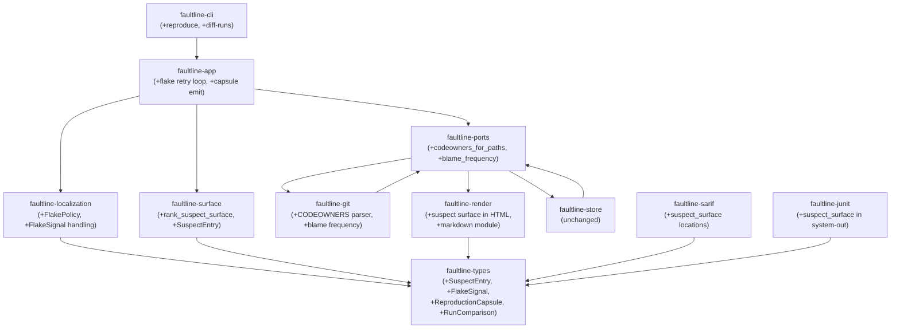

# Design Document — v0.1 Product Sharpening

## Overview

This design specifies the delta changes to the faultline codebase for the v0.1 product sharpening pass. The work spans three tiers: product differentiation features (ranked suspect surface, Markdown dossier, flake-aware probing, reproduction capsule, run-to-run comparison), verification depth (mutation coverage, fuzz targets, BDD scenarios, scenario atlas enrichment), and repo maturation (xtask authority, repo-law cleanup, teaching layer depth).

All changes respect the existing hexagonal architecture: domain logic stays pure in `faultline-codes`, `faultline-types`, `faultline-localization`, and `faultline-surface`; adapters handle I/O behind port traits; the app layer orchestrates. No new crates are added except optionally `faultline-markdown` as a thin adapter for Markdown export. Property-based tests are additive, starting at P43.

### Design Decisions

1. **Ranked suspect surface lives in `faultline-surface`** — it extends the existing `SurfaceAnalyzer` with a new `rank_suspect_surface` function that takes `&[PathChange]` plus optional owner hints and returns `Vec<SuspectEntry>`. This keeps ranking logic pure and testable.

2. **Owner hints require new `HistoryPort` methods** — CODEOWNERS parsing and git-blame frequency are Git adapter concerns. Two new methods on `HistoryPort`: `codeowners_for_paths` and `blame_frequency`. The domain consumes `Option<String>` owner hints without knowing the source.

3. **Flake-aware probing changes the localization engine** — `LocalizationSession` gains a `FlakePolicy` (retries, stability_threshold) and `FlakeSignal` is added to `ProbeObservation`. The app orchestrator handles retry loops; the domain records flake signals and degrades confidence.

4. **Reproduction capsule is a domain value object** — `ReproductionCapsule` in `faultline-types` captures predicate/env/working-dir/commit/timeout. The render layer and a new CLI `reproduce` subcommand consume it.

5. **Run comparison is a new domain module** — `RunComparison` and `RunDiff` types in `faultline-types`, with a pure `compare_runs` function. CLI `diff-runs` subcommand consumes it.

6. **Markdown export goes in `faultline-render`** as a `markdown` module — no new crate needed for the initial implementation. If it grows, it can be extracted to `faultline-markdown`.

7. **Schema version bumps to `"0.2.0"`** — the `suspect_surface` field, `FlakeSignal`, and `ReproductionCapsule` additions to `AnalysisReport` are breaking changes.

## Architecture

The existing hexagonal architecture is preserved. Changes are delta-only:



### Dependency Direction (unchanged)

- Domain crates (`codes`, `types`, `localization`, `surface`) have no I/O dependencies
- Adapters depend inward on `ports` and `types`
- App depends on `ports` + domain
- CLI depends on `app` + adapters

### New Data Flow for Ranked Suspect Surface

```
GitAdapter::changed_paths → Vec<PathChange>
GitAdapter::codeowners_for_paths → HashMap<String, Option<String>>
GitAdapter::blame_frequency → HashMap<String, Option<String>>
    ↓
SurfaceAnalyzer::rank_suspect_surface(changes, owners) → Vec<SuspectEntry>
    ↓
AnalysisReport.suspect_surface = ranked entries
    ↓
ReportRenderer renders in HTML/JSON/Markdown
```

### New Data Flow for Flake-Aware Probing

```
CLI --retries N --stability-threshold 0.8
    ↓
FaultlineApp::localize_with_options (retry loop per probe)
    ↓
Multiple ProbeObservation results per commit → FlakeSignal computed
    ↓
LocalizationSession::record (with FlakeSignal) → confidence degradation
    ↓
AnalysisReport.observations[].flake_signal populated
```

## Components and Interfaces

### 1. Suspect Surface Ranking (`faultline-surface`)

**New public API:**

```rust
/// A single entry in the ranked suspect surface.
#[derive(Debug, Clone, PartialEq, Eq, Serialize, Deserialize, JsonSchema)]
pub struct SuspectEntry {
    pub path: String,
    pub priority_score: u32,
    pub surface_kind: String,
    pub change_status: ChangeStatus,
    pub is_execution_surface: bool,
    pub owner_hint: Option<String>,
}

impl SurfaceAnalyzer {
    /// Rank changed paths by investigation priority.
    /// `owners` maps path → optional owner string (from CODEOWNERS or blame).
    pub fn rank_suspect_surface(
        &self,
        changes: &[PathChange],
        owners: &HashMap<String, Option<String>>,
    ) -> Vec<SuspectEntry>;
}
```

**Scoring rules (deterministic):**
- Base score: 100
- Execution surface (workflow, build.rs, .sh): +200
- Deleted file: +150
- Renamed file: +100
- Source file: +50
- Test file: +25
- Tie-breaking: lexicographic path order (descending score, ascending path)

### 2. Owner Hints (`faultline-ports` + `faultline-git`)

**New port methods:**

```rust
pub trait HistoryPort {
    // ... existing methods ...

    /// Parse CODEOWNERS and return owner for each path. Returns empty map if no CODEOWNERS.
    fn codeowners_for_paths(&self, paths: &[String]) -> Result<HashMap<String, Option<String>>>;

    /// Derive owner from git-blame frequency (most-frequent committer in last 90 days).
    fn blame_frequency(&self, paths: &[String]) -> Result<HashMap<String, Option<String>>>;
}
```

**GitAdapter implementation:**
- `codeowners_for_paths`: reads `.github/CODEOWNERS` or `CODEOWNERS` from repo root, parses gitignore-style patterns, matches paths, returns first matching owner
- `blame_frequency`: runs `git log --format='%aN' --since='90 days ago' -- <path>` for each path, returns most-frequent author

### 3. Flake-Aware Probing (`faultline-types` + `faultline-localization` + `faultline-app`)

**New types in `faultline-types`:**

```rust
#[derive(Debug, Clone, PartialEq, Eq, Serialize, Deserialize, JsonSchema)]
pub struct FlakePolicy {
    pub retries: u32,           // 0 = no retries (default)
    pub stability_threshold: f64, // 0.0–1.0, default 1.0
}

#[derive(Debug, Clone, PartialEq, Eq, Serialize, Deserialize, JsonSchema)]
pub struct FlakeSignal {
    pub total_runs: u32,
    pub pass_count: u32,
    pub fail_count: u32,
    pub skip_count: u32,
    pub indeterminate_count: u32,
    pub is_stable: bool,
}
```

**ProbeObservation gains:**
```rust
pub struct ProbeObservation {
    // ... existing fields ...
    #[serde(default)]
    pub flake_signal: Option<FlakeSignal>,
}
```

**LocalizationSession changes:**
- Constructor accepts `FlakePolicy`
- `record()` checks `flake_signal.is_stable` — unstable observations degrade confidence
- `outcome()` includes `FlakeSignal` awareness in confidence scoring

**App orchestrator changes:**
- When `flake_policy.retries > 0`, probe each commit up to `1 + retries` times
- Compute `FlakeSignal` from the set of results
- Classify using majority vote weighted by `stability_threshold`
- Re-probe ambiguous/boundary commits if initial result is unstable

### 4. Reproduction Capsule (`faultline-types` + `faultline-render` + `faultline-cli`)

**New type in `faultline-types`:**

```rust
#[derive(Debug, Clone, PartialEq, Eq, Serialize, Deserialize, JsonSchema)]
pub struct ReproductionCapsule {
    pub commit: CommitId,
    pub predicate: ProbeSpec,
    pub env: Vec<(String, String)>,
    pub working_dir: String,
    pub timeout_seconds: u64,
}

impl ReproductionCapsule {
    /// Generate a shell script that reproduces this probe.
    pub fn to_shell_script(&self) -> String;
}
```

**AnalysisReport gains:**
```rust
pub struct AnalysisReport {
    // ... existing fields ...
    pub reproduction_capsules: Vec<ReproductionCapsule>,
}
```

**CLI `reproduce` subcommand:**
```
faultline reproduce --run-dir <path> [--commit <sha>] [--shell]
```
- Reads the report from `run-dir`, extracts capsule for the given commit (or boundary commits by default)
- `--shell` emits a shell script to stdout instead of executing

### 5. Run-to-Run Comparison (`faultline-types` + `faultline-cli`)

**New types in `faultline-types`:**

```rust
#[derive(Debug, Clone, PartialEq, Eq, Serialize, Deserialize)]
pub struct RunComparison {
    pub left_run_id: String,
    pub right_run_id: String,
    pub outcome_changed: bool,
    pub confidence_delta: i16,
    pub window_width_delta: i64,
    pub probes_reused: usize,
    pub suspect_paths_added: Vec<String>,
    pub suspect_paths_removed: Vec<String>,
    pub ambiguity_reasons_added: Vec<AmbiguityReason>,
    pub ambiguity_reasons_removed: Vec<AmbiguityReason>,
}

/// Pure function: compare two reports.
pub fn compare_runs(left: &AnalysisReport, right: &AnalysisReport) -> RunComparison;
```

**CLI `diff-runs` subcommand:**
```
faultline diff-runs --left <path> --right <path> [--json]
```

### 6. Markdown Dossier Export (`faultline-render`)

**New module `faultline-render::markdown`:**

```rust
pub fn render_markdown(report: &AnalysisReport) -> String;
```

**Dossier sections:**
1. Outcome summary (one-line: FirstBad/SuspectWindow/Inconclusive with commits)
2. Boundary info (good commit, bad commit, window width)
3. Ranked suspect surface (top 10 paths with scores and owners)
4. Observation timeline (table: commit | class | duration | flake?)
5. Reproduction command (shell one-liner for boundary commit)
6. Artifact links (paths to analysis.json, index.html)

**CLI integration:** `--markdown` flag or `faultline export-markdown --run-dir <path>`

### 7. Verification Depth (Requirements 6–9)

#### 7a. Deeper Mutation Coverage (Req 6)

Extend `mutants.toml` `examine_re` to include:
- `faultline_git::`
- `faultline_probe_exec::`
- `faultline_store::`
- `faultline_render::`
- `faultline_sarif::`
- `faultline_junit::`
- `faultline_surface::`

Update `cargo xtask mutants` to accept `--crate <name>` for targeted runs.

#### 7b. More Fuzz Targets (Req 7)

New fuzz targets in `fuzz/fuzz_targets/`:
- `fuzz_git_diff_parse.rs` — fuzz Git adapter diff output parsing
- `fuzz_store_json.rs` — fuzz store JSON deserialization (malformed observations.json)
- `fuzz_html_escape.rs` — fuzz renderer HTML escaping with adversarial strings
- `fuzz_cli_args.rs` — fuzz CLI argument parsing via clap
- `fuzz_sarif_export.rs` — fuzz SARIF serialization with arbitrary reports
- `fuzz_junit_export.rs` — fuzz JUnit serialization with arbitrary reports

#### 7c. Heavier BDD/Scenario Coverage (Req 8)

New outer-flow scenarios:
- Report generation end-to-end (app → render → verify artifacts)
- Resume/rerender (load cached observations, re-render)
- Schema evolution (deserialize old-version report, verify forward compat)
- Export surfaces (SARIF + JUnit from same report, verify consistency)
- CI contract failures (simulate schema drift, verify xtask detects it)

#### 7d. Scenario Atlas Enrichment (Req 9)

Add metadata columns to `docs/scenarios/scenario_index.md`:
- `scenario_tier` (domain | adapter | app | integration)
- `requirement_ids` (e.g., "Req 1.1, 1.2")
- `artifact_contract` (e.g., "analysis.json", "index.html", "—")
- `mutation_surface` (crate targeted by mutation testing)
- `criticality` (P0 | P1 | P2)
- `ownership_hint` (crate owner or team)
- `human_review_required` (yes | no)

### 8. Repo Maturation (Requirements 10–12)

#### 8a. Xtask Authority (Req 10)

- `cargo xtask smoke`: real smoke test using `GitRepoBuilder` to create a fixture repo, run faultline CLI against it, verify exit code and artifact existence
- `cargo xtask docs-check`: real link checking using `lychee` or `markdown-link-check`
- New explicit commands: `generate-schema`, `check-scenarios`, `export-markdown`, `export-sarif`, `export-junit`

#### 8b. Repo-Law Cleanup (Req 11)

- Fix `Cargo.toml` workspace `authors` field
- Remove placeholder language from docs
- Align docs with current reality (crate map, verification matrix, scenario atlas)
- Fix stale references

#### 8c. Teaching Layer Depth (Req 12)

New maintainer playbooks:
- Reviewing failing property tests
- Deciding test technique (property vs unit vs golden vs fuzz)
- Bumping `schema_version`
- Handling breaking changes

More worked examples in the handbook. Stronger Diátaxis depth (tutorials, how-to, reference, explanation).

## Data Models

### New Types (delta to `faultline-types`)

```rust
// --- Suspect Surface ---

#[derive(Debug, Clone, PartialEq, Eq, Serialize, Deserialize, JsonSchema)]
pub struct SuspectEntry {
    pub path: String,
    pub priority_score: u32,
    pub surface_kind: String,
    pub change_status: ChangeStatus,
    pub is_execution_surface: bool,
    pub owner_hint: Option<String>,
}

// --- Flake-Aware Probing ---

#[derive(Debug, Clone, PartialEq, Serialize, Deserialize, JsonSchema)]
pub struct FlakePolicy {
    pub retries: u32,
    pub stability_threshold: f64,
}

impl Default for FlakePolicy {
    fn default() -> Self {
        Self { retries: 0, stability_threshold: 1.0 }
    }
}

#[derive(Debug, Clone, PartialEq, Eq, Serialize, Deserialize, JsonSchema)]
pub struct FlakeSignal {
    pub total_runs: u32,
    pub pass_count: u32,
    pub fail_count: u32,
    pub skip_count: u32,
    pub indeterminate_count: u32,
    pub is_stable: bool,
}

// --- Reproduction Capsule ---

#[derive(Debug, Clone, PartialEq, Eq, Serialize, Deserialize, JsonSchema)]
pub struct ReproductionCapsule {
    pub commit: CommitId,
    pub predicate: ProbeSpec,
    pub env: Vec<(String, String)>,
    pub working_dir: String,
    pub timeout_seconds: u64,
}

// --- Run Comparison ---

#[derive(Debug, Clone, PartialEq, Eq, Serialize, Deserialize)]
pub struct RunComparison {
    pub left_run_id: String,
    pub right_run_id: String,
    pub outcome_changed: bool,
    pub confidence_delta: i16,
    pub window_width_delta: i64,
    pub probes_reused: usize,
    pub suspect_paths_added: Vec<String>,
    pub suspect_paths_removed: Vec<String>,
    pub ambiguity_reasons_added: Vec<AmbiguityReason>,
    pub ambiguity_reasons_removed: Vec<AmbiguityReason>,
}

// --- Scenario Atlas Metadata ---

#[derive(Debug, Clone, PartialEq, Eq, Serialize, Deserialize)]
pub struct ScenarioMetadata {
    pub scenario_tier: String,
    pub requirement_ids: Vec<String>,
    pub artifact_contract: Option<String>,
    pub mutation_surface: Option<String>,
    pub criticality: String,
    pub ownership_hint: Option<String>,
    pub human_review_required: bool,
}
```

### Modified Types

**`AnalysisReport`** gains three new fields:

```rust
pub struct AnalysisReport {
    pub schema_version: String,        // bumped to "0.2.0"
    pub run_id: String,
    pub created_at_epoch_seconds: u64,
    pub request: AnalysisRequest,
    pub sequence: RevisionSequence,
    pub observations: Vec<ProbeObservation>,
    pub outcome: LocalizationOutcome,
    pub changed_paths: Vec<PathChange>,
    pub surface: SurfaceSummary,
    // NEW:
    pub suspect_surface: Vec<SuspectEntry>,
    pub reproduction_capsules: Vec<ReproductionCapsule>,
}
```

**`ProbeObservation`** gains:
```rust
pub struct ProbeObservation {
    // ... existing fields ...
    #[serde(default)]
    pub flake_signal: Option<FlakeSignal>,
}
```

**`SearchPolicy`** gains:
```rust
pub struct SearchPolicy {
    pub max_probes: usize,
    #[serde(default)]
    pub flake_policy: FlakePolicy,
}
```

**`AnalysisRequest`** gains:
```rust
pub struct AnalysisRequest {
    // ... existing fields ...
    // flake_policy is accessed via policy.flake_policy
}
```

### Schema Version

`schema_version` bumps from `"0.1.0"` to `"0.2.0"`. The JSON schema at `schemas/analysis-report.schema.json` must be regenerated. Golden snapshots must be updated.


## Correctness Properties

*A property is a characteristic or behavior that should hold true across all valid executions of a system — essentially, a formal statement about what the system should do. Properties serve as the bridge between human-readable specifications and machine-verifiable correctness guarantees.*

Properties below are additive to the existing P1–P42 numbering.

### Property 43: Suspect surface ranking is sorted and deterministic

*For any* set of `PathChange` values and any owners map, calling `rank_suspect_surface` twice with identical inputs SHALL produce identical `Vec<SuspectEntry>` output, and that output SHALL be sorted by descending `priority_score` with ties broken by ascending lexicographic path order.

**Validates: Requirements 1.1, 1.10**

### Property 44: Execution surfaces, renames, and deletes score higher than ordinary modifications

*For any* set of `PathChange` values containing at least one execution surface (workflow/build.rs/shell script), one renamed file, one deleted file, and one ordinary modified source file, the `priority_score` of each execution surface, renamed, and deleted entry SHALL be strictly greater than the score of the ordinary modified source entry.

**Validates: Requirements 1.2**

### Property 45: SuspectEntry preserves change_status and has consistent surface_kind

*For any* `PathChange`, the resulting `SuspectEntry` SHALL have `change_status` equal to the input `PathChange.status`, and `surface_kind` equal to the value returned by the existing `surface_kind()` classification function for that path, and `is_execution_surface` equal to the value returned by `is_execution_surface()`.

**Validates: Requirements 1.6, 1.7**

### Property 46: SuspectEntry owner_hint matches the provided owners map

*For any* set of `PathChange` values and any owners map (`HashMap<String, Option<String>>`), each `SuspectEntry.owner_hint` SHALL equal the value in the owners map for that path. If the path is absent from the owners map, `owner_hint` SHALL be `None`.

**Validates: Requirements 1.3, 1.4, 1.5**

### Property 47: Markdown dossier contains all required sections

*For any* `AnalysisReport` with at least one observation and a non-Inconclusive outcome, the output of `render_markdown` SHALL contain: (a) the outcome variant name and boundary commit IDs, (b) the good and bad revision specs from the request, (c) at least one suspect surface path if `suspect_surface` is non-empty, (d) a table row for each observation containing the commit ID and observation class, and (e) a reproduction command string if `reproduction_capsules` is non-empty.

**Validates: Requirements 2.1, 2.2, 2.3, 2.4, 2.5**

### Property 48: FlakeSignal stability classification

*For any* set of `ObservationClass` values (representing retry results for a single commit) and any `stability_threshold` in `[0.0, 1.0]`, the computed `FlakeSignal.is_stable` SHALL be `true` if and only if the proportion of the most-frequent observation class is greater than or equal to `stability_threshold`. The counts (`pass_count`, `fail_count`, `skip_count`, `indeterminate_count`) SHALL sum to `total_runs`.

**Validates: Requirements 3.2, 3.3**

### Property 49: Flaky observations degrade confidence

*For any* `LocalizationSession` that reaches a `FirstBad` or `SuspectWindow` outcome, if one or more observations have `flake_signal.is_stable == false`, the resulting `confidence.score` SHALL be strictly less than the confidence score of an equivalent session where all observations have `flake_signal.is_stable == true` (or no flake_signal).

**Validates: Requirements 3.4**

### Property 50: Default FlakePolicy produces no FlakeSignal

*For any* `LocalizationSession` constructed with the default `FlakePolicy` (retries=0), all observations in the resulting report SHALL have `flake_signal == None`.

**Validates: Requirements 3.6**

### Property 51: ReproductionCapsule structural correspondence

*For any* `AnalysisReport`, the number of `reproduction_capsules` SHALL equal the number of `observations`, and for each capsule, there SHALL exist a corresponding observation with the same `commit`, and the capsule's `predicate` SHALL equal `request.probe`, and the capsule's `timeout_seconds` SHALL equal the probe spec's timeout.

**Validates: Requirements 4.1, 4.2**

### Property 52: Shell script generation contains required fields

*For any* `ReproductionCapsule`, the output of `to_shell_script()` SHALL contain the target commit SHA, the predicate command (program name or shell script), the timeout value, and each environment variable key-value pair from the capsule's `env` field.

**Validates: Requirements 4.4**

### Property 53: compare_runs is total

*For any* two valid `AnalysisReport` values, `compare_runs(left, right)` SHALL return a `RunComparison` without panicking.

**Validates: Requirements 5.1**

### Property 54: Self-comparison yields zero diff

*For any* `AnalysisReport`, `compare_runs(report, report.clone())` SHALL produce a `RunComparison` where `outcome_changed == false`, `confidence_delta == 0`, `window_width_delta == 0`, `probes_reused` equals the number of observations, and `suspect_paths_added`, `suspect_paths_removed`, `ambiguity_reasons_added`, and `ambiguity_reasons_removed` are all empty.

**Validates: Requirements 5.3**

### Property 55: CODEOWNERS parser determinism

*For any* valid CODEOWNERS file content (lines of pattern + owner pairs) and any file path, parsing the CODEOWNERS content and matching the path SHALL produce a deterministic result: the same content and path always yield the same owner (or None).

**Validates: Requirements 1.3**

## Error Handling

### Suspect Surface

- If `changed_paths` is empty, `rank_suspect_surface` returns an empty `Vec<SuspectEntry>` (not an error).
- If the owners map is empty, all `owner_hint` fields are `None`.
- CODEOWNERS parsing errors (malformed file) are logged as warnings; the adapter returns an empty map and falls back to blame frequency.
- `blame_frequency` errors (git not available, repo not found) are logged as warnings; the adapter returns an empty map.

### Flake-Aware Probing

- If `retries > 0` and the probe adapter fails (I/O error, not a predicate failure), the retry loop stops and the error propagates as `FaultlineError::Probe`.
- If `stability_threshold` is outside `[0.0, 1.0]`, the CLI rejects the input with `FaultlineError::InvalidInput`.
- If all retries produce `Indeterminate`, the observation is recorded with `ObservationClass::Indeterminate` and `FlakeSignal { is_stable: false, ... }`.

### Reproduction Capsule

- If the report has no observations, `reproduction_capsules` is empty (not an error).
- `to_shell_script()` escapes shell-special characters in predicate arguments and environment values.
- The `reproduce` subcommand returns `FaultlineError::Store` if the run directory or report file is missing.

### Run Comparison

- `compare_runs` never fails — it always returns a `RunComparison`. If reports have incompatible schemas, `outcome_changed` is `true` and deltas reflect the structural differences.
- The `diff-runs` subcommand returns `FaultlineError::Store` if either report file is missing or unparseable.

### Markdown Export

- `render_markdown` never fails — it returns a `String`. Missing or empty fields produce placeholder text (e.g., "No suspect surface available").
- The `export-markdown` subcommand returns `FaultlineError::Store` if the report file is missing.

### Fuzz Targets

- Fuzz targets must not panic on any input. Malformed inputs should produce `Err` results, not panics.

## Testing Strategy

### Dual Testing Approach

This spec uses both unit tests and property-based tests:

- **Unit tests**: specific examples, edge cases, error conditions, golden snapshots, integration flows
- **Property tests**: universal properties across randomly generated inputs (P43–P55)

Together they provide comprehensive coverage: unit tests catch concrete bugs at known boundaries, property tests verify general correctness across the input space.

### Property-Based Testing Configuration

- **Library**: `proptest` (already used throughout the workspace)
- **Minimum iterations**: 100 cases per property test (`ProptestConfig { cases: 100, .. ProptestConfig::default() }`)
- **Tag format**: Each property test MUST include a comment: `// Feature: v01-product-sharpening, Property {N}: {title}`
- **Each correctness property MUST be implemented by a SINGLE property-based test**

### Property Test Placement

| Property | Crate | Notes |
|----------|-------|-------|
| P43: Ranking sorted & deterministic | `faultline-surface` | Pure domain, uses `arb_path_change()` |
| P44: Score ordering by type | `faultline-surface` | Pure domain, generates mixed PathChange sets |
| P45: SuspectEntry field consistency | `faultline-surface` | Pure domain, verifies against `surface_kind()` / `is_execution_surface()` |
| P46: Owner hint map fidelity | `faultline-surface` | Pure domain, generates random owners maps |
| P47: Markdown section completeness | `faultline-render` | Adapter, uses `arb_analysis_report()` extended with new fields |
| P48: FlakeSignal stability | `faultline-types` or `faultline-localization` | Pure domain, generates random observation class sets + thresholds |
| P49: Flaky confidence degradation | `faultline-localization` | Pure domain, metamorphic: compare flaky vs non-flaky sessions |
| P50: Default FlakePolicy no signal | `faultline-localization` | Pure domain, verify no flake_signal with default policy |
| P51: Capsule structural correspondence | `faultline-app` or `faultline-types` | Verify capsule-observation alignment |
| P52: Shell script content | `faultline-types` | Pure domain, generate random capsules, check script content |
| P53: compare_runs totality | `faultline-types` | Pure domain, generate two random reports |
| P54: Self-comparison zero diff | `faultline-types` | Pure domain, generate one report, compare with clone |
| P55: CODEOWNERS parser determinism | `faultline-git` | Adapter, generate random CODEOWNERS content + paths |

### New Arbitrary Generators Needed (`faultline-fixtures`)

Extend `faultline-fixtures::arb` with:

```rust
pub fn arb_suspect_entry() -> impl Strategy<Value = SuspectEntry>;
pub fn arb_flake_signal() -> impl Strategy<Value = FlakeSignal>;
pub fn arb_flake_policy() -> impl Strategy<Value = FlakePolicy>;
pub fn arb_reproduction_capsule() -> impl Strategy<Value = ReproductionCapsule>;
pub fn arb_run_comparison() -> impl Strategy<Value = RunComparison>;
// Updated arb_analysis_report() to include new fields
pub fn arb_analysis_report_v2() -> impl Strategy<Value = AnalysisReport>;
```

### Unit Test Coverage Plan

| Area | Tests | Crate |
|------|-------|-------|
| Suspect ranking edge cases | Empty input, single path, all same score, all execution surfaces | `faultline-surface` |
| CODEOWNERS parsing | Valid patterns, wildcards, comments, empty file, malformed lines | `faultline-git` |
| Blame frequency | No commits, single author, multiple authors, 90-day window | `faultline-git` |
| FlakeSignal computation | All pass, all fail, mixed, threshold boundary | `faultline-localization` |
| Reproduction capsule | Shell script escaping, Exec vs Shell variants, empty env | `faultline-types` |
| Run comparison | Same report, different outcomes, different confidence, different paths | `faultline-types` |
| Markdown export | All three outcome types, empty observations, empty suspect surface | `faultline-render` |
| CLI subcommands | `reproduce --help`, `diff-runs --help`, `--retries` validation | `faultline-cli` |

### Mutation Testing Expansion

Extend `mutants.toml` to cover all adapter and export crates. The `cargo xtask mutants` command should support `--crate <name>` for targeted runs.

### Fuzz Target Plan

| Target | Input | Crate Exercised |
|--------|-------|-----------------|
| `fuzz_git_diff_parse` | Arbitrary byte strings simulating `git diff --name-status` output | `faultline-git` |
| `fuzz_store_json` | Arbitrary byte strings as `observations.json` content | `faultline-store` |
| `fuzz_html_escape` | Arbitrary strings with HTML-special characters | `faultline-render` |
| `fuzz_cli_args` | Arbitrary string vectors as CLI arguments | `faultline-cli` |
| `fuzz_sarif_export` | Arbitrary `AnalysisReport` JSON → SARIF conversion | `faultline-sarif` |
| `fuzz_junit_export` | Arbitrary `AnalysisReport` JSON → JUnit conversion | `faultline-junit` |

### Golden Snapshot Updates

The following golden snapshots must be updated after implementing the new fields:
- `faultline-render` `analysis.json` snapshot (new `suspect_surface`, `reproduction_capsules` fields)
- `faultline-render` `index.html` snapshot (suspect surface rendering)
- `faultline-cli` `--help` snapshot (new subcommands and flags)
- JSON schema at `schemas/analysis-report.schema.json` (regenerated via `cargo xtask generate-schema`)
