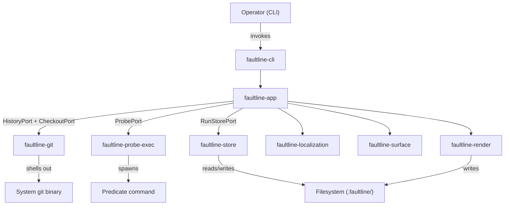
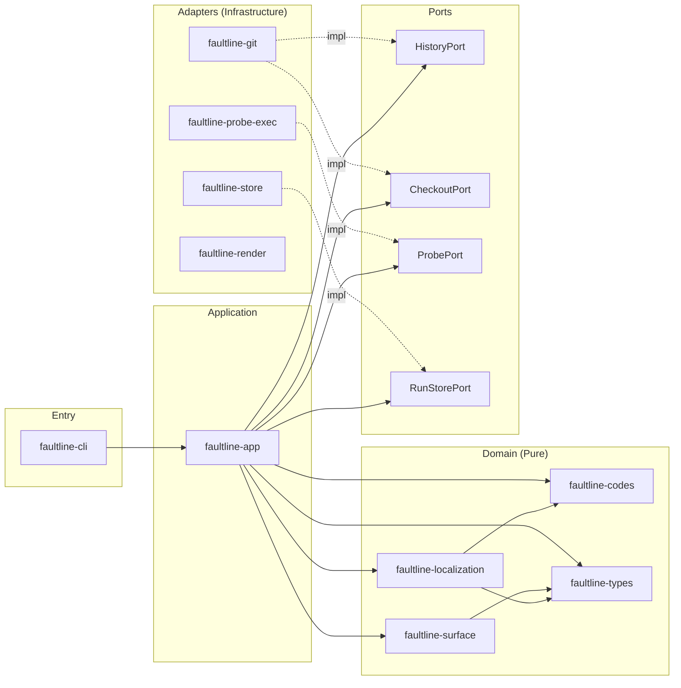
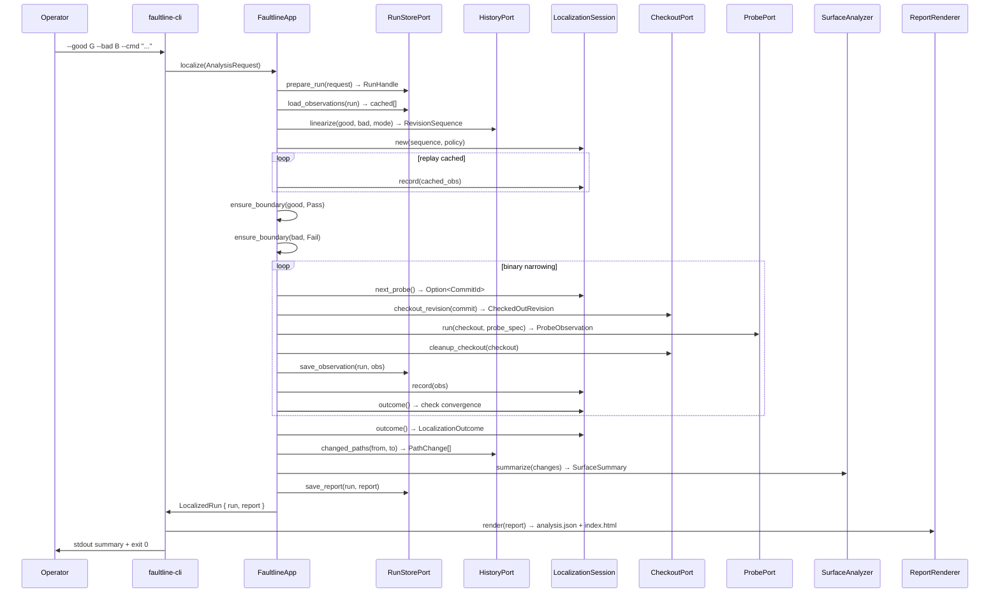
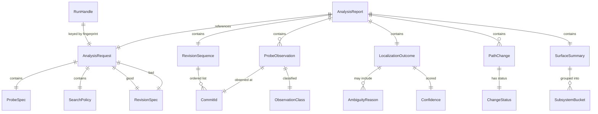

# Design Document — faultline v0.1 Release Train

## Overview

This design covers the complete v0.1 release of faultline — a local-first regression archaeologist for Git repositories. The system accepts a known-good commit, a known-bad commit, and an operator-supplied predicate command, then narrows the regression window via binary search over a linearized commit history, producing JSON and HTML artifacts that describe the narrowest credible regression window.

The design preserves the existing hexagonal architecture: two pure domain crates (localization, surface), four port traits, five infrastructure adapters, one application orchestrator, and one CLI entry point. All 13 requirements from the requirements document are addressed across a wave-based delivery plan (Waves 0–7).

### Key Design Decisions

1. **System git binary over libgit2** — defers Git semantics to the tool operators already trust; keeps the adapter thin and replaceable (ADR-0002).
2. **Honest localization outcomes** — the engine returns FirstBad, SuspectWindow, or Inconclusive; it never claims more certainty than the evidence supports (ADR-0003).
3. **Hexagonal architecture** — domain logic is pure and testable with synthetic fixtures; all I/O flows through port traits (ADR-0001).
4. **Disposable linked worktrees** — each probe runs in an isolated checkout under `.faultline/scratch/`, preventing mutation of the operator's working copy.
5. **Fingerprint-keyed run persistence** — observations are cached by request fingerprint so interrupted runs resume without re-probing.

## Architecture

### System Context



### Hexagonal Layers



### Data Flow — Localization Run




## Components and Interfaces

### 1. faultline-codes — Shared Vocabulary

Defines the enum types shared across all crates. No business logic.

```rust
// Existing — no changes needed for v0.1
pub enum ObservationClass { Pass, Fail, Skip, Indeterminate }
pub enum ProbeKind { Build, Test, Lint, PerfThreshold, Custom }
pub enum AmbiguityReason {
    MissingPassBoundary, MissingFailBoundary,
    NonMonotonicEvidence, SkippedRevision,
    IndeterminateRevision, UntestableWindow,
    BoundaryValidationFailed, NeedsMoreProbes,
}
pub enum OperatorCode { Success, SuspectWindow, Inconclusive, InvalidInput, ExecutionError }
```

### 2. faultline-types — Value Objects and Report Model

All serializable value types. Key structures already exist; no structural changes needed for v0.1.

```rust
// Key types (existing)
pub struct CommitId(pub String);
pub struct RevisionSpec(pub String);
pub enum HistoryMode { AncestryPath, FirstParent }
pub enum ProbeSpec { Exec { .. }, Shell { .. } }
pub struct SearchPolicy { pub max_probes: usize, pub edge_refine_threshold: usize }
pub struct AnalysisRequest { repo_root, good, bad, history_mode, probe, policy }
pub struct RevisionSequence { pub revisions: Vec<CommitId> }
pub struct ProbeObservation { commit, class, kind, exit_code, timed_out, duration_ms, stdout, stderr }
pub struct Confidence { pub score: u8, pub label: String }
pub enum LocalizationOutcome { FirstBad { .. }, SuspectWindow { .. }, Inconclusive { .. } }
pub struct PathChange { pub status: ChangeStatus, pub path: String }
pub struct SubsystemBucket { name, change_count, paths, surface_kinds }
pub struct SurfaceSummary { total_changes, buckets, execution_surfaces }
pub struct RunHandle { id, root, resumed }
pub struct CheckedOutRevision { commit, path }
pub struct AnalysisReport { run_id, created_at_epoch_seconds, request, sequence, observations, outcome, changed_paths, surface }
```

All types derive `Serialize + Deserialize` for JSON round-tripping. `AnalysisReport` is the canonical artifact model — both `analysis.json` and `index.html` are derived from it.

### 3. faultline-ports — Hexagonal Port Traits

Four port traits define the outbound boundary. Existing signatures are sufficient for v0.1.

```rust
pub trait HistoryPort {
    fn linearize(&self, good: &RevisionSpec, bad: &RevisionSpec, mode: HistoryMode) -> Result<RevisionSequence>;
    fn changed_paths(&self, from: &CommitId, to: &CommitId) -> Result<Vec<PathChange>>;
}

pub trait CheckoutPort {
    fn checkout_revision(&self, commit: &CommitId) -> Result<CheckedOutRevision>;
    fn cleanup_checkout(&self, checkout: &CheckedOutRevision) -> Result<()>;
}

pub trait ProbePort {
    fn run(&self, checkout: &CheckedOutRevision, probe: &ProbeSpec) -> Result<ProbeObservation>;
}

pub trait RunStorePort {
    fn prepare_run(&self, request: &AnalysisRequest) -> Result<RunHandle>;
    fn load_observations(&self, run: &RunHandle) -> Result<Vec<ProbeObservation>>;
    fn save_observation(&self, run: &RunHandle, observation: &ProbeObservation) -> Result<()>;
    fn save_report(&self, run: &RunHandle, report: &AnalysisReport) -> Result<()>;
}
```

### 4. faultline-localization — Regression-Window Engine

Pure domain. Drives binary narrowing over a `RevisionSequence` using recorded `ProbeObservation` values.

Key algorithms:

**Binary narrowing (`next_probe`):**
1. Ensure boundaries are probed first (first, last in sequence).
2. Find the tightest pass/fail boundary pair (`boundaries_and_reasons`).
3. Collect unobserved indices between boundaries.
4. Return the median unobserved index (binary search midpoint).
5. Return `None` when no unobserved candidates remain.

**Outcome determination (`outcome`):**
1. Compute pass/fail boundary indices and ambiguity reasons.
2. If no pass boundary → `Inconclusive(MissingPassBoundary)`.
3. If no fail boundary → `Inconclusive(MissingFailBoundary)`.
4. If unobserved commits exist between boundaries → `Inconclusive(NeedsMoreProbes)`.
5. If skipped/indeterminate commits exist → `SuspectWindow` with appropriate reasons.
6. If fail precedes pass → `SuspectWindow` with `NonMonotonicEvidence`, confidence low.
7. Otherwise → `FirstBad` with confidence high.

```rust
pub struct LocalizationSession {
    sequence: RevisionSequence,
    policy: SearchPolicy,
    observations: BTreeMap<usize, ProbeObservation>,
    index_by_commit: HashMap<CommitId, usize>,
}

impl LocalizationSession {
    pub fn new(sequence: RevisionSequence, policy: SearchPolicy) -> Result<Self>;
    pub fn record(&mut self, observation: ProbeObservation) -> Result<()>;
    pub fn has_observation(&self, commit: &CommitId) -> bool;
    pub fn get_observation(&self, commit: &CommitId) -> Option<&ProbeObservation>;
    pub fn next_probe(&self) -> Option<CommitId>;
    pub fn outcome(&self) -> LocalizationOutcome;
    pub fn observation_list(&self) -> Vec<ProbeObservation>;
    pub fn sequence(&self) -> &RevisionSequence;
    pub fn max_probes(&self) -> usize;
}
```

### 5. faultline-surface — Changed-Surface Bucketing

Pure domain. Groups `PathChange` entries into `SubsystemBucket` values by top-level directory and assigns surface kinds.

```rust
pub struct SurfaceAnalyzer;

impl SurfaceAnalyzer {
    pub fn summarize(&self, changes: &[PathChange]) -> SurfaceSummary;
}

// Internal classification functions:
fn bucket_name(path: &str) -> String;       // top-level directory
fn surface_kind(path: &str) -> String;       // source|tests|benchmarks|scripts|workflows|docs|build-script|lockfile|migrations|other
fn is_execution_surface(path: &str) -> bool; // workflows, build scripts, shell scripts
```

### 6. faultline-git — Git CLI Adapter

Implements `HistoryPort` and `CheckoutPort` by shelling out to the system `git` binary.

```rust
pub struct GitAdapter {
    repo_root: PathBuf,
    scratch_root: PathBuf, // .faultline/scratch/
}

impl GitAdapter {
    pub fn new(repo_root: impl Into<PathBuf>) -> Result<Self>;
}

// HistoryPort: linearize via `git rev-list --reverse --ancestry-path [--first-parent]`
// HistoryPort: changed_paths via `git diff --name-status`
// CheckoutPort: checkout_revision via `git worktree add --detach --force`
// CheckoutPort: cleanup_checkout via `git worktree remove --force` + fallback rm -rf
```

Worktree naming: `{sha_prefix_12}-{timestamp_ms}-{atomic_counter}` under `.faultline/scratch/`.

### 7. faultline-probe-exec — Process Execution Adapter

Implements `ProbePort`. Spawns the predicate command, polls for completion with 50ms sleep intervals, enforces timeout.

```rust
pub struct ExecProbeAdapter;

impl ProbePort for ExecProbeAdapter {
    fn run(&self, checkout: &CheckedOutRevision, probe: &ProbeSpec) -> Result<ProbeObservation>;
}

// Exit code classification:
// 0 → Pass, 125 → Skip, other non-zero → Fail, timeout → Indeterminate
```

### 8. faultline-store — Filesystem Run Store

Implements `RunStorePort`. Persists under `.faultline/runs/{fingerprint}/`.

```rust
pub struct FileRunStore { root: PathBuf }

impl FileRunStore {
    pub fn new(root: impl Into<PathBuf>) -> Result<Self>;
}

// Directory layout per run:
// .faultline/runs/{fingerprint}/
//   ├── request.json
//   ├── observations.json
//   └── report.json
```

Resumability: `prepare_run` checks if the directory exists; if so, sets `RunHandle.resumed = true`. `load_observations` reads the existing `observations.json`. `save_observation` appends/upserts by commit ID and re-writes the file.

### 9. faultline-render — Artifact Writers

Writes `analysis.json` and `index.html` from an `AnalysisReport`.

```rust
pub struct ReportRenderer { output_dir: PathBuf }

impl ReportRenderer {
    pub fn new(output_dir: impl Into<PathBuf>) -> Self;
    pub fn render(&self, report: &AnalysisReport) -> Result<()>;
    pub fn output_dir(&self) -> &Path;
}
```

JSON: `serde_json::to_string_pretty` for human readability. Determinism is guaranteed by the stable field ordering from serde's derive.

HTML: Self-contained static page with inline CSS. All dynamic content is HTML-escaped via a dedicated `escape_html` function. Sections: run ID, outcome summary, observation timeline table, changed-surface buckets, changed paths list.

### 10. faultline-app — Application Orchestrator

Wires ports together and drives the localization lifecycle.

```rust
pub struct FaultlineApp<'a> {
    history: &'a dyn HistoryPort,
    checkout: &'a dyn CheckoutPort,
    probe: &'a dyn ProbePort,
    store: &'a dyn RunStorePort,
    surface: SurfaceAnalyzer,
}

impl<'a> FaultlineApp<'a> {
    pub fn new(history, checkout, probe, store) -> Self;
    pub fn localize(&self, request: AnalysisRequest) -> Result<LocalizedRun>;
}

pub struct LocalizedRun {
    pub run: RunHandle,
    pub report: AnalysisReport,
}
```

**`localize` algorithm:**
1. `store.prepare_run(request)` → `RunHandle`
2. `store.load_observations(run)` → replay cached observations
3. `history.linearize(good, bad, mode)` → `RevisionSequence`
4. Create `LocalizationSession::new(sequence, policy)`
5. Replay cached observations into session
6. `ensure_boundary(good_index, Pass)` — probe if not cached, validate class
7. `ensure_boundary(bad_index, Fail)` — probe if not cached, validate class
8. Loop: `session.next_probe()` → checkout → probe → cleanup → save → record → check convergence
9. `session.outcome()` → `LocalizationOutcome`
10. If boundary pair exists: `history.changed_paths(from, to)` → `surface.summarize(changes)`
11. Build `AnalysisReport`, `store.save_report(run, report)`
12. Return `LocalizedRun { run, report }`

### 11. faultline-cli — Operator Entry Point

Parses CLI args via clap derive, constructs adapters, calls `FaultlineApp::localize`, renders artifacts, prints summary.

```rust
#[derive(Debug, Parser)]
struct Cli {
    #[arg(long, default_value = ".")] repo: PathBuf,
    #[arg(long)] good: String,
    #[arg(long)] bad: String,
    #[arg(long, default_value_t = false)] first_parent: bool,
    #[arg(long)] cmd: Option<String>,
    #[arg(long)] program: Option<String>,
    #[arg(long = "arg", allow_hyphen_values = true)] args: Vec<String>,
    #[arg(long, default_value = "custom")] kind: String,
    #[arg(long, default_value_t = 300)] timeout_seconds: u64,
    #[arg(long, default_value = "faultline-report")] output_dir: PathBuf,
    #[arg(long, default_value_t = 64)] max_probes: usize,
}
```

Exit codes: `0` on success, `2` on error. Mutual exclusion of `--cmd` / `--program` enforced before constructing `ProbeSpec`.

### 12. faultline-fixtures — Test Fixture Builders

Provides builders for constructing synthetic test data without real Git repos.

```rust
pub struct RevisionSequenceBuilder {
    revisions: Vec<CommitId>,
}

impl RevisionSequenceBuilder {
    pub fn push(mut self, revision: impl Into<String>) -> Self;
    pub fn build(self) -> RevisionSequence;
}
```

Used in unit tests for `faultline-localization` to construct deterministic scenarios (exact boundary, skipped midpoint, timeout island, non-monotonic, all-untestable, cached resume).

## Data Models

### Core Entity Relationships



### Filesystem Layout

```
.faultline/
├── scratch/                          # Disposable worktrees (transient)
│   └── {sha12}-{timestamp}-{counter}/  # One per active probe
└── runs/                             # Persistent run store
    └── {request_fingerprint}/        # One directory per unique request
        ├── request.json              # Serialized AnalysisRequest
        ├── observations.json         # Array of ProbeObservation
        └── report.json               # Final AnalysisReport

{output_dir}/                         # Operator-specified output
├── analysis.json                     # Canonical JSON artifact
└── index.html                        # Human-readable HTML report
```

### Serialization Contract

All types in `faultline-types` that appear in `AnalysisReport` derive `Serialize + Deserialize`. The JSON schema is implicitly defined by serde's derive macro with default field naming. Key guarantees:

- Field order is stable (struct declaration order via serde derive)
- Enum variants use externally tagged representation (serde default)
- `CommitId` serializes as a plain string via its newtype wrapper
- `AnalysisReport` round-trips: `deserialize(serialize(report)) == report`

### Exit Code Classification Table

| Predicate Exit | Timeout? | ObservationClass |
|---------------|----------|-----------------|
| 0             | No       | Pass            |
| 125           | No       | Skip            |
| Other non-zero| No       | Fail            |
| Any / None    | Yes      | Indeterminate   |

### CLI Exit Code Table

| Condition | Exit Code |
|-----------|-----------|
| Successful run | 0 |
| Any error (invalid input, probe failure, I/O) | 2 |

## Correctness Properties

*A property is a characteristic or behavior that should hold true across all valid executions of a system — essentially, a formal statement about what the system should do. Properties serve as the bridge between human-readable specifications and machine-verifiable correctness guarantees.*

The following properties were derived from the 13 requirements by analyzing each acceptance criterion for testability, then consolidating redundant properties. Each property is universally quantified and references the requirement(s) it validates.

### Property 1: Exit Code Classification

*For any* exit code value and timeout status, the `classify` function shall return the correct `ObservationClass`: `Pass` for exit 0 (no timeout), `Skip` for exit 125 (no timeout), `Fail` for any other non-zero exit (no timeout), and `Indeterminate` for any timeout regardless of exit code.

**Validates: Requirements 2.3, 2.4, 2.5, 2.6**

### Property 2: Observation Structural Completeness

*For any* probe execution that completes (whether pass, fail, skip, timeout, or error), the resulting `ProbeObservation` shall have all fields populated: `commit` is non-empty, `exit_code` is `Some` when the process exited normally, `timed_out` is true iff the timeout was exceeded, `duration_ms` is non-negative, and `stdout`/`stderr` are captured strings.

**Validates: Requirements 2.7, 4.7**

### Property 3: Revision Sequence Boundary Invariant

*For any* `RevisionSequence` produced by `linearize`, the first element shall be the resolved good commit, the last element shall be the resolved bad commit, and the sequence shall contain at least two elements.

**Validates: Requirements 1.4, 1.5**

### Property 4: Binary Narrowing Selects Valid Midpoint

*For any* `LocalizationSession` with established pass and fail boundaries and at least one unobserved candidate between them, `next_probe()` shall return a `CommitId` that (a) lies strictly between the current pass and fail boundary indices, and (b) has no existing observation.

**Validates: Requirement 3.1**

### Property 5: Adjacent Pass-Fail Yields FirstBad

*For any* `RevisionSequence` and observation set where the highest pass index and lowest subsequent fail index are adjacent (differ by 1) with no skip or indeterminate observations between them, `outcome()` shall return `LocalizationOutcome::FirstBad` with `last_good` equal to the pass commit and `first_bad` equal to the fail commit.

**Validates: Requirement 3.2**

### Property 6: Ambiguous Observations Yield SuspectWindow

*For any* `LocalizationSession` with established pass and fail boundaries where one or more commits between the boundaries are classified as `Skip` or `Indeterminate`, `outcome()` shall return `LocalizationOutcome::SuspectWindow` with the corresponding `AmbiguityReason` (`SkippedRevision` and/or `IndeterminateRevision`) present in the reasons list.

**Validates: Requirements 3.3, 3.4**

### Property 7: Non-Monotonic Evidence Yields Low Confidence

*For any* observation set where a `Fail` observation exists at a lower index than a `Pass` observation in the `RevisionSequence`, `outcome()` shall include `AmbiguityReason::NonMonotonicEvidence` in the reasons and the confidence score shall equal `Confidence::low().score`.

**Validates: Requirement 3.5**

### Property 8: Missing Boundary Yields Inconclusive

*For any* `LocalizationSession` where no `Pass` observation has been recorded, `outcome()` shall return `Inconclusive` with `MissingPassBoundary`. Symmetrically, *for any* session where no `Fail` observation has been recorded, `outcome()` shall return `Inconclusive` with `MissingFailBoundary`.

**Validates: Requirements 3.6, 3.7**

### Property 9: Probe Count Respects Max Probes

*For any* `LocalizationSession` with a `SearchPolicy` specifying `max_probes = N`, the localization loop in `FaultlineApp::localize` shall execute at most `N` probe operations before terminating.

**Validates: Requirement 3.8**

### Property 10: FirstBad Requires Direct Evidence

*For any* `LocalizationSession` that produces a `FirstBad` outcome, the `last_good` commit shall have a recorded observation with class `Pass`, and the `first_bad` commit shall have a recorded observation with class `Fail`.

**Validates: Requirements 3.9, 11.1**

### Property 11: Run Store Round-Trip

*For any* valid `ProbeObservation`, saving it via `save_observation` then loading via `load_observations` shall return a list containing an equivalent observation. *For any* valid `AnalysisReport`, saving via `save_report` then reading the file and deserializing shall produce an equivalent report. *For any* valid `AnalysisRequest`, the `request.json` written by `prepare_run` shall deserialize to an equivalent request.

**Validates: Requirements 4.2, 4.5, 4.6**

### Property 12: Run Store Resumability

*For any* valid `AnalysisRequest`, calling `prepare_run` twice with the same request shall produce a `RunHandle` where the second call has `resumed == true`, and `load_observations` on the second handle shall return all observations saved during the first run.

**Validates: Requirement 4.3**

### Property 13: Surface Analysis Invariants

*For any* non-empty slice of `PathChange` values, `SurfaceAnalyzer::summarize` shall produce a `SurfaceSummary` where: (a) `total_changes` equals the input length, (b) every input path appears in exactly one `SubsystemBucket`, (c) each bucket's `name` equals the top-level directory of its paths, (d) each path is assigned a valid surface kind from the defined set, and (e) `execution_surfaces` is a subset of the input paths containing only workflow files, build scripts, and shell scripts.

**Validates: Requirements 5.2, 5.3, 5.4**

### Property 14: JSON Serialization Determinism

*For any* valid `AnalysisReport`, serializing to JSON twice shall produce byte-identical output.

**Validates: Requirement 6.3**

### Property 15: AnalysisReport JSON Round-Trip

*For any* valid `AnalysisReport`, serializing to JSON via `serde_json::to_string_pretty` then deserializing back via `serde_json::from_str` shall produce a value equal to the original.

**Validates: Requirement 6.5**

### Property 16: HTML Contains Required Data Consistent with JSON

*For any* valid `AnalysisReport`, the rendered HTML string shall contain: the `run_id`, the outcome type label (FirstBad/SuspectWindow/Inconclusive), the boundary commit SHAs (when present), and one `<tr>` row per observation. These values shall be consistent with the data in the corresponding `analysis.json`.

**Validates: Requirements 7.2, 7.4, 11.5**

### Property 17: HTML Escaping Correctness

*For any* string containing HTML special characters (`<`, `>`, `&`, `"`, `'`), the `escape_html` function shall replace each with its corresponding HTML entity, and the output shall not contain any unescaped instances of those characters.

**Validates: Requirement 7.5**

### Property 18: HTML Is Self-Contained

*For any* valid `AnalysisReport`, the rendered HTML shall not contain any `<link>`, `<script>`, or `` tags referencing external URLs (http:// or https://).

**Validates: Requirement 7.3**

### Property 19: Worktree Path Uniqueness

*For any* two calls to `GitAdapter::unique_worktree_path` (even with the same `CommitId`), the returned paths shall be distinct.

**Validates: Requirement 9.4**

### Property 20: Boundary Validation Rejects Mismatched Classes

*For any* `AnalysisRequest` where the good boundary commit evaluates as anything other than `Pass`, or the bad boundary commit evaluates as anything other than `Fail`, `FaultlineApp::localize` shall return an `InvalidBoundary` error containing the expected and actual observation classes.

**Validates: Requirements 10.1, 10.2, 10.3, 10.4**

### Property 21: Monotonic Window Narrowing

*For any* `LocalizationSession`, recording a new observation shall result in the candidate window size (upper boundary index minus lower boundary index) being less than or equal to the window size before the observation was recorded. The window shall never expand.

**Validates: Requirement 11.2**

### Property 22: SuspectWindow Confidence Cap

*For any* `LocalizationSession` that produces a `SuspectWindow` outcome, the confidence score shall be strictly less than `Confidence::high().score` (95).

**Validates: Requirement 11.3**

### Property 23: Observation Order Independence

*For any* set of `ProbeObservation` values and `RevisionSequence`, recording the observations in any permutation order shall produce the same `LocalizationOutcome`.

**Validates: Requirement 11.4**

## Error Handling

### Error Type Hierarchy

All errors flow through `FaultlineError` (defined in `faultline-types`), which uses `thiserror` for ergonomic derivation:

```rust
pub enum FaultlineError {
    InvalidInput(String),      // Bad CLI args, invalid revision specs
    InvalidBoundary(String),   // Good doesn't pass or bad doesn't fail
    Git(String),               // git CLI failures (rev-parse, worktree, diff)
    Probe(String),             // Predicate spawn/execution failures
    Store(String),             // Filesystem persistence failures
    Render(String),            // Artifact writing failures
    Domain(String),            // Localization logic errors
    Io(String),                // General I/O errors
    Serde(String),             // JSON serialization/deserialization errors
}
```

### Error Propagation Strategy

| Layer | Error Source | Handling |
|-------|------------|----------|
| CLI | Clap parse errors | Clap prints help/error, exits non-zero |
| CLI | `--cmd` / `--program` mutual exclusion | Print message to stderr, exit 2 |
| App | `InvalidBoundary` from `ensure_boundary` | Propagate to CLI → stderr + exit 2 |
| App | `Git` errors from linearize/checkout | Propagate to CLI → stderr + exit 2 |
| App | `Probe` errors from predicate execution | Propagate to CLI → stderr + exit 2 |
| App | Cleanup failure after probe | Probe error takes priority; cleanup error logged but not fatal if probe succeeded |
| Store | Missing/corrupt `observations.json` | Return empty vec (default deserialization) |
| Store | Filesystem write failures | Propagate as `Io` or `Serde` error |
| Localization | Empty revision sequence | Return `Domain` error |
| Localization | Observation for unknown commit | Return `Domain` error |
| Render | Output directory creation failure | Propagate as `Io` error |

### Cleanup-on-Error Semantics

The `probe_commit` method in `FaultlineApp` handles the critical cleanup path:

```rust
fn probe_commit(&self, request, commit) -> Result<ProbeObservation> {
    let checkout = self.checkout.checkout_revision(commit)?;
    let result = self.probe.run(&checkout, &request.probe);
    let cleanup = self.checkout.cleanup_checkout(&checkout);
    match (result, cleanup) {
        (Ok(obs), Ok(())) => Ok(obs),
        (Err(err), Ok(())) => Err(err),      // probe failed, cleanup ok
        (Ok(_), Err(cleanup_err)) => Err(cleanup_err), // probe ok, cleanup failed
        (Err(err), Err(_)) => Err(err),       // both failed, probe error wins
    }
}
```

The `cleanup_checkout` implementation itself has a two-tier fallback:
1. Try `git worktree remove --force`
2. If that fails, fall back to `fs::remove_dir_all`
3. Return `Ok(())` even if both fail (best-effort cleanup)

### Exit Code Contract

| Scenario | CLI Exit Code |
|----------|--------------|
| Successful localization (any outcome type) | 0 |
| Invalid input (bad flags, missing args) | 2 |
| Invalid boundary (good doesn't pass, bad doesn't fail) | 2 |
| Git error (can't resolve revisions, ancestry check fails) | 2 |
| Probe error (can't spawn predicate) | 2 |
| I/O error (can't write artifacts) | 2 |

## Testing Strategy

### Dual Testing Approach

The v0.1 test suite uses two complementary strategies:

1. **Unit tests** — specific examples, edge cases, error conditions, integration scenarios
2. **Property-based tests** — universal properties across randomly generated inputs

Both are necessary: unit tests catch concrete bugs and document expected behavior; property tests verify general correctness across the input space.

### Property-Based Testing Library

**Library:** [`proptest`](https://crates.io/crates/proptest) (Rust's most mature property-based testing framework)

**Configuration:**
- Minimum 100 iterations per property test (`PROPTEST_CASES=100` or `ProptestConfig { cases: 100, .. }`)
- Each property test is tagged with a comment referencing its design property
- Tag format: `// Feature: v01-release-train, Property {N}: {title}`

**Each correctness property from the design document maps to exactly one `proptest` test function.**

### Property Test Plan

| Property | Crate Under Test | Generator Strategy |
|----------|-----------------|-------------------|
| P1: Exit Code Classification | `faultline-probe-exec` | Generate `(Option<i32>, bool)` pairs for `(exit_code, timed_out)` |
| P2: Observation Completeness | `faultline-probe-exec` | Generate valid `ProbeSpec` + mock checkout; verify field population |
| P3: Sequence Boundary Invariant | `faultline-git` (or fixtures) | Generate `RevisionSequence` via builder; verify first/last/length |
| P4: Binary Narrowing Midpoint | `faultline-localization` | Generate sequences of length 3–50, record boundary observations, verify `next_probe()` |
| P5: Adjacent Pass-Fail → FirstBad | `faultline-localization` | Generate sequences, record pass at i, fail at i+1, verify outcome |
| P6: Ambiguous → SuspectWindow | `faultline-localization` | Generate sequences with skip/indeterminate between boundaries |
| P7: Non-Monotonic → Low Confidence | `faultline-localization` | Generate sequences with fail before pass |
| P8: Missing Boundary → Inconclusive | `faultline-localization` | Generate sequences with only pass or only fail observations |
| P9: Max Probes Respected | `faultline-app` (with mock ports) | Generate small max_probes values, verify loop terminates |
| P10: FirstBad Evidence | `faultline-localization` | Generate any session producing FirstBad, verify boundary observations |
| P11: Store Round-Trip | `faultline-store` | Generate random `ProbeObservation`, `AnalysisRequest`, `AnalysisReport` values |
| P12: Store Resumability | `faultline-store` | Generate request + observations, prepare twice, verify resumed flag |
| P13: Surface Invariants | `faultline-surface` | Generate random `PathChange` vectors |
| P14: JSON Determinism | `faultline-types` | Generate random `AnalysisReport`, serialize twice, compare bytes |
| P15: JSON Round-Trip | `faultline-types` | Generate random `AnalysisReport`, serialize then deserialize |
| P16: HTML Data Consistency | `faultline-render` | Generate random `AnalysisReport`, render both artifacts, verify consistency |
| P17: HTML Escaping | `faultline-render` | Generate strings with special chars, verify escape correctness |
| P18: HTML Self-Contained | `faultline-render` | Generate random `AnalysisReport`, verify no external URLs in HTML |
| P19: Worktree Path Uniqueness | `faultline-git` | Generate pairs of `CommitId`, call `unique_worktree_path` twice, verify distinct |
| P20: Boundary Validation | `faultline-app` (with mock ports) | Generate boundary observations with wrong classes, verify error |
| P21: Monotonic Narrowing | `faultline-localization` | Generate observation sequences, verify window never expands |
| P22: SuspectWindow Confidence Cap | `faultline-localization` | Generate sessions producing SuspectWindow, verify score < 95 |
| P23: Observation Order Independence | `faultline-localization` | Generate observation sets, record in multiple permutations, compare outcomes |

### Unit Test Plan

| Scenario | Crate | Type |
|----------|-------|------|
| Exact first-bad (3 commits, pass-fail-fail) | `faultline-localization` | Fixture (existing) |
| Skipped midpoint yields SuspectWindow | `faultline-localization` | Fixture (existing) |
| Timeout island yields SuspectWindow | `faultline-localization` | Fixture |
| Non-monotonic predicate | `faultline-localization` | Fixture |
| All revisions untestable | `faultline-localization` | Fixture |
| Cached resume (no re-probing) | `faultline-app` | Integration with mock ports |
| Surface bucketing by top-level dir | `faultline-surface` | Fixture (existing) |
| CLI rejects both --cmd and --program | `faultline-cli` | Example |
| CLI rejects neither --cmd nor --program | `faultline-cli` | Example |
| CLI --help output snapshot | `faultline-cli` | Snapshot |
| Non-ancestor good/bad returns error | `faultline-git` | Integration |
| Good boundary doesn't pass → InvalidBoundary | `faultline-app` | Integration with mock ports |
| Bad boundary doesn't fail → InvalidBoundary | `faultline-app` | Integration with mock ports |
| Workspace Cargo.toml has required metadata | workspace | Example |
| ADR files exist | workspace | Example |

### Test Organization

- Property tests live alongside unit tests in each crate's `#[cfg(test)]` module
- `proptest` is added as a `[dev-dependencies]` to crates that need property tests
- `faultline-fixtures` provides shared builders used by both unit and property tests
- Integration tests requiring mock ports use trait objects with test doubles
- No tests require a real Git repository (all use synthetic fixtures or mock ports)

### Coverage Goals

- Every correctness property (P1–P23) has exactly one `proptest` test
- Every fixture scenario from Requirement 12 has a dedicated unit test
- CLI argument validation has example-based tests for each error path
- Store round-trip and resumability are tested with temp directories
